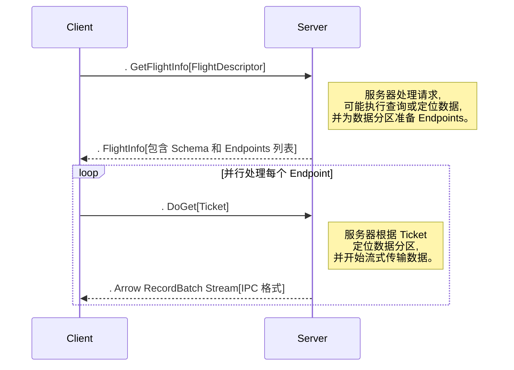

# Arrow

https://gemini.google.com/app/ab194aa23b5c87f8

## Apache Arrow 的起源与愿景

本章旨在阐明 Apache Arrow 项目诞生的根本原因。它将超越简单的定义，深入探讨催生这一项目的具体技术背景和生态系统层面的挑战。

### 前 Arrow 时代的问题：数据分析的“最后一公里”危机

**数据分析生态的瓶颈**

| 问题维度 | 具体表现 | 影响 |
|---|---|---|
| **数据孤岛** | 每个框架专有内存格式 | 系统间无法直接交换数据 |
| **序列化陷阱** | CSV/JSON中间格式转换 | CPU密集型，多次数据拷贝 |
| **性能瓶颈** | SerDe过程耗时 | 成为分析流程中的主要延迟 |

**典型案例**
```
Spark(JVM) → 序列化 → CSV → 反序列化 → pandas(Python)
```

要理解 Apache Arrow 的重要性，我们必须首先回顾 年前后数据分析生态系统的状态。尽管像 Apache Spark 和 Hadoop 这样的系统已经成功解决了大规模分布式计算的难题，但一个关键的瓶颈依然存在：在不同系统和进程之间移动数据。

这个核心问题可以被概括为“序列化/反序列化陷阱”。当时，每一个主流的数据处理框架——无论是 Spark 运行的 JVM、Python 生态中的 pandas，还是 R 语言的 data.frame——都拥有其专有的、优化的内存数据表示格式。这些数据帧（Data Frames）实际上是相互隔离的“孤岛”，它们之间存在着难以逾越的序列化壁垒。

当数据需要从一个系统流向另一个系统时，即使这两个系统运行在同一台物理机器上，也必须经过一个极其昂贵的过程。数据首先被序列化（或称“转换”）为一个通用的中间格式，如 CSV 或 JSON，或者通过自定义的序列化器转换为字节流。然后，接收方系统再将这些字节流反序列化，并解析成其内部的内存格式。这个序列化与反序列化的往返过程（SerDe）是计算密集型的，并且极其浪费内存，因为它通常涉及多次数据拷贝。这不仅消耗了大量的 CPU 周期，也成为了整个数据分析流程中一个严重的性能瓶颈。

### Wes McKinney 的愿景：以标准化破局

**核心构想：列式数据中间件**

| 目标 | 实现方式 | 预期效果 |
|---|---|---|
| **零拷贝访问** | 共享内存机制 | 消除序列化开销 |
| **标准化格式** | 语言无关的规范 | 跨系统互操作 |
| **高效IPC** | 优化的进程间通信 | 最小化网络传输开销 |

**基金会战略**
- ✅ **Apache孵化器**：中立协作平台
- ✅ **多项目合作**：Drill/Impala/Kudu/Spark
- ✅ **社区驱动**：14个主要开源项目参与

Apache Arrow 的诞生，正是为了解决这一根本性难题。它源于项目联合创始人 Wes McKinney（同时也是 pandas 的创建者）多年来在数据分析领域积累的经验和面对上述低效问题时的深刻反思。无论是在他创建 pandas 的早期，还是后来在 Cloudera 的工作经历中，数据交换的低效性始终是一个痛点。

McKinney 的核心构想，当时他称之为一种“列式数据中间件”（columnar data middleware），是创建一个所有系统都能理解和使用的、与编程语言无关的、标准化的内存列式数据格式。这个愿景的目标是：对于位于同一台机器上的进程，通过共享内存实现数据的“零拷贝”访问，从而彻底消除序列化开销；对于跨网络传输的进程，则通过一种高效的进程间通信（IPC）格式，将开销降至最低。

为了实现这一宏大的目标，项目从一开始就被战略性地置于 Apache 软件基金会（ASF）的羽翼之下。这一决策非常重要，因为它创建了一个中立的、不受任何单一供应商控制的“安全区”，从而鼓励了来自不同背景甚至相互竞争的开源项目（如 Drill、Impala、Kudu、Spark 等）的开发者们进行合作。这种开放和协作的模式是 Arrow 得以被广泛接受和采纳的关键。

### Arrow 项目的核心信条与承诺

| 原则 | 技术实现 | 业务价值 |
|---|---|---|
| **标准优先** | 列式内存布局规范 | 系统间互操作 |
| **零拷贝** | 无需指针修正的重定位 | 共享内存直接访问 |
| **硬件优化** | SIMD友好的连续布局 | CPU/GPU并行计算 |
| **工具箱** | 多语言库+格式支持 | 端到端解决方案 |

Apache Arrow 的设计理念根植于几个核心原则，这些原则共同构成了其颠覆性影响力的基础。

- 一个标准，而非仅仅一个库：Arrow 最核心的贡献是其列式内存布局的规范。项目提供的多语言库是这一规范的参考实现。通过首先定义一个清晰、明确的标准，Arrow 使得不同的系统可以在不依赖任何特定实现的情况下进行互操作。
- 零拷贝数据访问：Arrow 格式被设计为“无需指针修正即可重定位”（relocatable without pointer swizzling）。这意味着内存中的 Arrow 数据块可以被直接移动或映射到另一个进程的地址空间，而无需修改其内部结构。这一特性是实现真正零拷贝数据共享的基石，无论是通过共享内存还是内存映射文件（memory-mapped files）。
- 为 CPU 和 GPU 效率而生：Arrow 的连续列式内存布局是为最大化现代硬件性能而精心设计的。它天然地支持缓存友好的数据访问模式，并为现代处理器中的 SIMD（单指令，多数据）指令集提供了理想的数据结构，从而实现大规模并行计算和向量化处理。
- “开箱即用”的开发平台：Arrow 不仅仅是一个数据格式规范，它更是一个“多语言工具箱”（multi-language toolbox）。它提供了一整套库和组件，用于高效地读写各种文件格式（如 Parquet、CSV）、进行远程过程调用（RPC），以及执行高性能的内存分析。

Arrow 的诞生并非源于一项全新的技术发明，而是源于一次卓越的标准化行动和巧妙的社区工程。列式存储、SIMD 等核心技术理念早已存在，但整个数据生态系统却因缺乏统一标准而处于碎片化状态。Arrow 的成功，在很大程度上归功于它通过建立一个中立的协作平台，解决了这个生态系统级别的“巴别塔”困境。它首先提出一个规范，让来自 个主要开源项目的开发者 能够围绕一个共同的愿景进行合作，从而打破了各个项目之间因私有内存格式而形成的壁垒。正是这种协调，释放了数据处理领域被压抑已久的巨大性能和互操作性潜力。

### 适用场景：

- 大数据处理系统的中间数据交换（如 Spark ↔ Pandas）
- 高性能序列化（取代 JSON/Protobuf 在列式场景下的劣势）
- GPU 加速和 SIMD 优化（Arrow 结构天然适合）
- 与内存数据库、OLAP 查询引擎协同使用

## 核心架构原理：速度的基石

本章将深入剖析 Arrow 高性能声明背后的“如何实现”，将其高层设计理念与它所利用的底层硬件特性紧密联系起来。

### 列式存储范式：深入解析

**存储模型对比**

| 特征 | 行式存储 | 列式存储 |
|---|---|---|
| **数据布局** | 按行连续存储 | 按列连续存储 |
| **适用场景** | OLTP事务处理 | OLAP分析查询 |
| **I/O效率** | 读取整行数据 | 只读所需列 |
| **压缩率** | 较低 | 较高（同类型数据） |
| **缓存友好** | 一般 | 优秀（SIMD优化） |

**性能优势**
- **I/O缩减**：分析查询只读取必要列
- **压缩效率**：同类型数据高压缩比
- **向量化**：SIMD指令并行处理

为了理解 Arrow 的设计，必须首先掌握行式存储与列式存储的根本区别。我们可以通过一个实际的类比来阐明这一点，例如 中提到的乐高积木例子。

- 行式存储（Row-based）：数据按行连续存储。一条记录的所有字段（如用户 ID、姓名、年龄）在内存中是相邻的。这种布局非常适合事务性工作负载（OLTP），例如，“获取用户 ID 为 的所有信息”。
- 列式存储（Columnar-based）：数据按列连续存储。一个属性（列）的所有值在内存中是相邻的。这种布局非常适合分析性工作负载（OLAP），例如，“计算所有商品的价格平均值”。这是因为分析查询通常需要访问大量行，但只关心其中的少数几列。

#### Row vs Column：

```text
Row-based    => {id:1,name:"A"} {id:2,name:"B"} ...
Column-based => id:[1,2,3], name:["A","B","C"]
```

列式布局带来了几个关键优势：

- I/O 缩减：分析查询只需从内存或磁盘中读取其真正需要的列，而无需加载整张表的全部数据，从而显著减少了 I/O 带宽的消耗。
- 提升压缩效率：同一列中的数据类型相同，且通常具有较低的信息熵（例如，“国家”列的唯一值很少），这使得数据可以被更有效地压缩，从而降低存储成本。

### 为现代硬件而设计：缓存、流水线与 SIMD

**缓存层次优化**
```
┌─────────────────────────┐
│      CPU 寄存器         │ ←ns
├─────────────────────────┤
│      L1/L2 缓存         │ ←ns
├─────────────────────────┤
│      L3 缓存            │ ←ns
├─────────────────────────┤
│      主内存             │ ←ns
└─────────────────────────┘
```

**SIMD向量化机制**
- **数据对齐**：64字节边界对齐
- **批量操作**：单指令处理多数据元素
- **缓存预取**：减少内存访问延迟

Arrow 的性能并非魔法，而是源于其对现代处理器架构的深刻理解和充分利用。

- 缓存局部性（Cache Locality）：现代 CPU 依赖于一个由 L1、L2、L3 缓存构成的层级结构，这些缓存的访问速度比主内存（RAM）快几个数量级。当 CPU 需要的数据不在缓存中时，就会发生“缓存未命中”（cache miss），这是导致性能停顿的主要原因之一。Arrow 的连续列式布局确保了在遍历一列数据时，后续的值极有可能已经被预取到 CPU 缓存中。这与行式存储形成鲜明对比，在行式存储中，不相关的列数据会“污染”缓存行，导致频繁的缓存未命中。
- 流水线与分支预测：处理列式数据的循环通常非常简单和紧凑（tight loops），这非常有利于现代 CPU 的指令流水线（pipelining）和分支预测（branch prediction）机制，从而减少了因等待或预测错误而导致的停顿。
- SIMD（单指令，多数据）：这是 Arrow 性能的核心秘密之一。现代 CPU 提供了特殊的指令集（如 x86 平台的 SSE、AVX，以及 ARM 平台的 Neon），这些指令能够在一个时钟周期内对多个数据点执行相同的操作（例如，同时计算 对整数的和）。Arrow 的内存布局被明确设计为 SIMD 友好的。通过确保数据在内存中是连续的，并且按照 字节对齐，可以非常容易地将一整块列数据加载到一个宽大的 SIMD 寄存器中，并以并行方式进行处理。这为数值计算带来了巨大的性能提升。

### 零拷贝的承诺：机制与细微差别

零拷贝是 Arrow 最引人注目的特性之一，它旨在通过消除不必要的数据副本来降低 CPU 和内存的开销。

- 定义：零拷贝意味着在不创建数据副本的情况下访问数据。
- 机制：共享内存（机器内部）：当两个进程在同一台机器上运行时，它们可以将同一块物理内存区域映射到各自的虚拟地址空间。由于 Arrow 格式是可重定位的（不包含在其他进程地址空间中会失效的指针），消费进程可以直接读取由生产进程准备好的数据，而无需任何拷贝。
- 机制：内存映射文件：对于存储在磁盘上的数据，Arrow 可以利用内存映射（mmap）技术。操作系统会将文件内容直接映射到进程的虚拟地址空间，并按需将数据分页加载到物理内存中。这使得应用程序可以像访问内存中的缓冲区一样访问磁盘文件，而无需通过显式的 read() 调用将数据拷贝到中间缓冲区，从而实现了从磁盘的“零拷贝读取”。
- 细微差别：“零拷贝”与高效 IPC：需要明确的是，当系统位于不同的物理机器上时（例如，Spark JVM 和 Python 工作进程在不同节点上），真正的零拷贝是不可能的。在这种情况下，Arrow 采用其高效的进程间通信（IPC）格式。该格式以极低的开销序列化内存布局，虽然仍涉及通过网络传输数据，但其效率远高于传统的序列化方法，如 JSON 或 Pickle。

Arrow 的卓越性能并非来自单一的“银弹”，而是其整体设计哲学的必然结果。这个设计全面地针对了从物理硬件（SIMD、缓存）到分布式系统层面（高效 IPC）的整个现代计算堆栈。其设计背后存在一个清晰的因果链：选择连续且硬件对齐的列式格式是其最根本的架构决策，这一决策直接促成了所有后续的性能优化。没有这种布局，SIMD 将难以实现，缓存效率将大打折扣。同样，“无需指针修正”的规则 是实现零拷贝共享内存的前提。因此，可以得出结论，物理内存格式规范是 Arrow 项目的核心公理，所有其他性能优势（如 IPC、Flight、计算内核）都是从这一基本原则中逻辑推导出来的。

## 组件深入分析 I：内存格式规范

本节将对 Arrow 格式本身进行权威的、规范级别的剖析，为任何希望实现 Arrow 读取器或写入器的开发者提供参考。

### 类型系统：逻辑与物理

Arrow 定义了一套丰富的逻辑数据类型，这些是面向应用开发者的数据类型。

- 原始类型（Primitive Types）：包括 Boolean、（U）Int{8,16,32,64}、Float{16,32,64}、Decimal{128,256}、Date{32,64}、Time{32,64}、Timestamp、Interval、Duration 和 FixedSizeBinary。
- 可变长度类型（Variable-Length Types）：包括 Binary、String（以及它们的 Large 位偏移量版本）。
- 嵌套类型（Nested Types）：包括 List、Struct、Map 和 Union（包含稀疏和密集两种模式）。
- 特殊类型（Specialized Types）：
    - 字典编码（Dictionary）：用于表示分类或枚举类型的数据。它将一个整数索引数组映射到一个包含唯一值的字典，从而极大地节省了存储空间并加速了分析操作。
    - 游程编码（Run-End Encoded, REE）：一种为包含长串重复值的数据设计的编码方式。
    - 扩展类型（Extension Types）：一种允许用户为标准的物理存储类型附加自定义语义的机制。例如，可以将 GeoJSON 字符串存储为逻辑上的“地理信息”类型，而其底层物理存储仍然是一个 String 数组。

### 物理内存布局：缓冲区（Buffers）

这是 Arrow 格式规范的核心。

#### 内存布局示意图：

以一个 `int32` 列为例：

```
+-------------+-------------+--------------+
| ValidityBit | Offsets     | Values       |
| Bitmap      | （可选）    | Int32 Array  |
+-------------+-------------+--------------+

```
#### Arrow Array
一个 Arrow Array 是元数据和一块或多块物理内存 Buffer 的组合。是一个单列的表示方式，包含以下部分：

| Field      | 作用                 |
| ---------- | ------------------ |
| `data`     | 真实值的内存地址           |
| `offsets`  | 可变长类型的偏移量          |
| `validity` | Null 值 bitmap（1/0） |
| `length`   | 数据长度               |

每种类型（Int32、List、Struct）都有自己的布局。

- 有效性（空值）位图（Validity Bitmap）：除了联合（Union）类型外，所有布局都包含一个有效性位图。这是一个位打包的缓冲区，其中 表示一个有效（非空）值，0 表示一个空值。这种设计将空值的表示与数据值本身分离，实现了高效的空值处理。
- 特定布局的缓冲区：
    - 原始类型布局（Primitive Layout）：一个单独的、连续的 values 缓冲区，用于存放原始值（例如，一个由 int32_t 组成的缓冲区）。
    - 可变长度二进制布局（Variable-size Binary Layout）：由两个缓冲区组成：一个包含 N+1 个整数（32 位或 位）的 offsets 缓冲区，用于定义每个值的起始和结束边界；以及一个单独的、连续的 data 缓冲区，包含了所有值连接起来的字节数据。
- 列表布局（List Layout）：与二进制布局类似，其 offsets 缓冲区指向一个子 Array 的值。
- 结构体布局（Struct Layout）：本身没有数据缓冲区。它只是一个容器，包含了每个字段对应的子数组集合。它拥有自己的有效性位图，用于表示顶层的结构体是否为空。
- 联合布局（Union Layout）：这是最复杂的布局之一。它包含一个 types 缓冲区（整数，指示每个槽位应从哪个子数组读取）以及一个（对于 Dense 联合而言）offsets 缓冲区，用于指示在所选子数组中的具体位置。

#### **RecordBatch**

- 类似于数据库中“表”的概念
- 包含：schema + 多个 Arrow Array（列）
- 所有列长度相同
```python
# Python 示例
import pyarrow as pa

batch = pa.record_batch([
    pa.array([1, 2, 3]),
    pa.array(["a", "b", "c"])
], names=["id", "name"])
```
#### **Table**

- 多个 RecordBatch 的逻辑集合
- 支持更大的数据集（如磁盘或分布式存储）
### 元数据与模式（Schema）：自描述的蓝图

一个 RecordBatch 或 Table 的结构由一个 Schema 来描述。

- 一个 Schema 是一系列 Field 的集合。每个 Field 包含一个名称、一个 DataType 以及可选的键值对元数据。描述字段名、类型、是否 nullable、metadata。
- 这些元数据使用 Google Flatbuffers 进行序列化。这是一个至关重要的架构选择：Flatbuffers 是一个高效的跨平台序列化库，它允许在不进行解析或解包的情况下访问序列化后的数据，这与 Arrow 的零拷贝哲学完美契合。
- 自定义元数据：用户可以为 Schema 和 Field 附加任意的键值对元数据（以字节形式）。这个功能被广泛使用，例如 pandas 库用它来存储索引信息以实现完美的双向转换，而像 ArcGIS 这样的系统则用它来存储空间参考信息。

Arrow 的设计中，物理布局与逻辑数据模型的分离是一项关键原则，它同时提供了高性能和灵活性。物理布局的严格性（如连续缓冲区、位图）是性能的保证，而丰富的类型系统和元数据则提供了强大的语义表达能力。例如，Timestamp 类型只是对物理 Int64 缓冲区的逻辑解释。这种解耦非常强大，它意味着新的逻辑类型可以被叠加在现有的物理布局之上（这是 ExtensionType 的基础），而无需改变核心格式。

此外，选择 Flatbuffers 作为元数据序列化方案是一个深思熟虑的架构决策。传统的元数据格式（如 JSON）需要将整个结构解析到中间对象中才能使用，这违背了 Arrow 的核心理念。Flatbuffers 允许直接从字节流中“就地”读取元数据，无需解析或额外的内存分配。这种架构上的一致性，即元数据和数据都采用“零拷贝”访问模型，体现了 Arrow 项目深刻且原则性的工程思想。

### Apache Arrow 进程间通信（IPC）文件与Feather V2格式
从实际使用角度看，Feather V2 格式与 Apache Arrow 的进程间通信（IPC）文件格式完全一致。这两者的区别主要是**历史性的命名差异**，这也常常是人们混淆的来源。

Feather 格式诞生于 Apache Arrow 项目早期，目的是为 Python（pandas）和 R 提供一种快速、语言无关的方式，将数据帧（DataFrame）存储到磁盘中。这个最初版本（V1）是一个**简化的、自定义的容器格式**，但它有一些明显的局限性：

- 仅支持 Arrow 类型的一个子集
- 不支持压缩
- 没有将**长期稳定性**作为设计目标

随着 Arrow 项目的成熟，开发者定义了一个更强大、标准化、稳定的磁盘表示格式：**Arrow IPC 格式**。它支持所有 Arrow 数据类型，并提供压缩、随机访问等关键功能。

为了解决 V1 的局限，Feather 格式进行了升级。**Feather V2 实际上就是 Arrow IPC 文件格式的一个实现**。

项目保留了易于使用的 Feather 名称和 API（如 `pyarrow.feather.write_feather()`），以保持向后兼容和友好的用户体验，但底层的文件结构就是符合 Arrow IPC 文件规范。这个改动也意味着 Feather 文件具备了与 Arrow IPC 相同的长期稳定性保障。

很多人常常混淆 IPC 规范下的两个不同变体：

#### **IPC 文件格式（File Format）**

- 支持**随机访问**
- 文件起始和结尾都有标识符魔数（`ARROW1`）
- 文件尾部包含**元数据 footer**（包含 schema 和各数据块 RecordBatch 的偏移信息
- 支持**内存映射**，非常适合**磁盘持久化存储**

#### **IPC 流格式（Stream Format）**

- 更加简单，设计用于**顺序传输**，如通过网络 socket 传输数据
- 是一串连续的消息（先 schema，后数据）
- **没有 footer 和魔数**，只能从头读到尾
- 适合**网络传输或数据流场景**

|特性|Feather V1（旧版）|Feather V2 / Arrow IPC 文件格式|
|---|---|---|
|底层规范|自定义，简化版的 Arrow 子集|官方 Arrow IPC 文件格式规范|
|主要用途|R / Python 中的临时快速存储|稳定、高效的磁盘存储和随机访问|
|数据类型支持|有限，仅支持 Arrow 的部分类型|全面支持所有 Arrow 类型|
|压缩支持|不支持|支持（如 LZ4、ZSTD）|
|随机访问|不支持|支持（通过元数据 footer）|
|稳定性|不适合长期存储|稳定，适合长期存储（Arrow 1.0.0 起）|
|典型 API|`write_feather(..., version=1)`|`write_feather(..., version=2)`（默认）、`write_ipc_file()`|

当你在现代 Arrow 库中使用默认设置写入 `.feather` 文件时，其实就是在创建一个**Arrow IPC 文件**。这两个名称可以互换使用，但：

- **“Arrow IPC 文件格式”** 是**正式的规范名称**
    
- **“Feather V2”** 是在 R 和 Python 等用户友好 API 中使用的**通用名称**。

```
Arrow IPC File (.arrow or.feather)
├── Magic Number "ARROW1" (6 bytes)
├── Padding (to 8-byte boundary, optional)
│
├── (Streaming Format Section)
│   ├── Schema Message (The first message, defines the table structure)
│   │   ├── Metadata Length (int32)
│   │   ├── Metadata (Flatbuffer containing Schema definition)
│   │   └── Message Body (empty for Schema message)
│   │
│   ├── DictionaryBatch Message 1 (Optional, for dictionary-encoded columns)
│   │   ├── Metadata Length (int32)
│   │   ├── Metadata (Flatbuffer for DictionaryBatch)
│   │   └── Message Body (A RecordBatch containing the dictionary values)
│   │       ├── Buffer 1 (e.g., Validity Bitmap)
│   │       └── Buffer 2 (e.g., Values)
│   │
│   ├──... (Other DictionaryBatch Messages)
│   │
│   ├── RecordBatch Message 1 (A block of rows)
│   │   ├── Metadata Length (int32)
│   │   ├── Metadata (Flatbuffer for RecordBatch, describes buffer layout)
│   │   └── Message Body (Contiguous raw data buffers for each column)
│   │       ├── Column 1, Buffer 1 (e.g., Validity Bitmap)
│   │       ├── Column 1, Buffer 2 (e.g., Offsets for variable-size types)
│   │       ├── Column 1, Buffer 3 (e.g., Values)
│   │       ├── Column 2, Buffer 1 (e.g., Validity Bitmap)
│   │       ├── Column 2, Buffer 2 (e.g., Values)
│   │       └──... (Other buffers for all columns in the batch)
│   │
│   └──... (Other RecordBatch Messages)
│
├── File Footer (Flatbuffer)
│   ├── Schema (Redundant copy of the Schema for convenience)
│   ├── Dictionaries (list<Block>)
│   │   └── Block 1 (Points to DictionaryBatch Message 1)
│   │       ├── offset (int64): Byte offset to the start of the message
│   │       ├── metaDataLength (int32): Size of the message's metadata
│   │       └── bodyLength (int64): Size of the message's body
│   │
│   └── RecordBatches (list<Block>)
│       ├── Block 1 (Points to RecordBatch Message 1)
│       │   ├── offset (int64): Byte offset to the start of the message
│       │   ├── metaDataLength (int32): Size of the message's metadata
│       │   └── bodyLength (int64): Size of the message's body
│       └──... (Other Blocks pointing to other RecordBatches)
│
├── Footer Length (int32)
└── Magic Number "ARROW1" (6 bytes)
```

## 组件深入分析 II：内存管理与所有权

本节将分析 Arrow 的 C++ 和 Java 内存管理模型，它们是 Arrow 安全性和效率的基石。

### C++ MemoryPool

- 目的：在 Arrow C++ 中，所有用于大型数据缓冲区的内存都通过一个 MemoryPool 实例进行分配。这提供了一个中心化的内存使用跟踪点，并允许使用可插拔的分配后端。
- 源码分析 (memory_pool.cc)：
    - default_memory_pool() 函数是获取默认内存池的入口。它会检查 ARROW_MEMORY_POOL_BACKEND 环境变量来选择一个后端。
    - 默认内存池的选择优先级通常是 mimalloc，其次是 jemalloc，最后是系统的 malloc，具体取决于编译时设置的标志（如 -DARROW_MIMALLOC=ON）。
    - mimalloc 和 jemalloc 通常优于系统分配器，因为它们针对多线程性能进行了高度优化，并能有效减少内存碎片。
    - Allocate 和 Free 的实现：
        - MemoryPool 是一个抽象基类，拥有虚方法 Allocate、Free 和 Reallocate。
        - 具体的实现（如 SystemAllocator、JemallocAllocator）分别封装了对应的 C 风格分配函数（malloc、je_malloc）。
        - 至关重要的是，这些方法强制执行了 Arrow 规范所要求的 字节对齐和填充。
        - 内存跟踪是通过内存池实现中的原子计数器（bytes_allocated_、max_memory_）来完成的，这些计数器在 Allocate/Reallocate 中增加，在 Free 中减少。
        - ProxyMemoryPool 和 LoggingMemoryPool 类则为更详细的跟踪提供了装饰器模式的实现。

### C++ Buffer 抽象与零拷贝切片

- 目的：arrow::Buffer 类是一个围绕原始内存指针和长度的轻量级封装。它是内存管理的主要工具，提供了与内存的安全交互，而这个内存可能由 Buffer 本身拥有，也可能不拥有。
- 所有权：Buffer 的生命周期由 std::shared_ptr 管理。这是安全管理内存的关键。
- 源码分析 (buffer.h 和 Buffer::Slice)：
    - Slice 操作不会拷贝数据。它创建一个新的 Buffer 对象，该对象的指针指向原始 Buffer 内存区域的内部。
    - 其核心在于切片构造函数：`Buffer(std::shared_ptr<Buffer> parent, const int64_t offset, const int64_t size)`.
    - 工作原理（零拷贝视图）：
   . 新的（切片后）缓冲区的数据指针被计算为 parent->data() + offset。它直接指向父缓冲区内存区域内的一个位置。
   . 新缓冲区的大小被设置为请求的切片 size。
   . 最关键的一步：新的缓冲区将父缓冲区的 `std::shared_ptr<Buffer>` 作为其成员变量 parent_ 保存起来。
   . 这意味着新的切片持有了对其父缓冲区的一个共享指针。只要这个切片（或任何其他从此父缓冲区创建的切片）存活，父缓冲区的引用计数就非零，从而防止父缓冲区的内存被释放。
   . 这个机制以极低的成本创建了一个零拷贝的视图，同时通过共享所有权保证了底层内存在所有切片的生命周期内都是有效的。

### JVM 中的内存管理（Java）

- **独立实现**：Java 的实现拥有自己独立的内存管理系统，并未封装 C++ 的实现。
- **核心组件**：
    - **ArrowBuf**：Java 中与 C++ Buffer 等价的类，代表一个连续的直接内存区域。它使用手动引用计数来管理其生命周期。
    - **BufferAllocator**：用于分配 ArrowBuf 的接口。其主要实现是 RootAllocator。
    - **基于树的记账模型**：Arrow Java 采用了一种层级式的分配器模型。应用启动时会创建一个 RootAllocator，然后可以从中创建子分配器用于特定的组件或任务。子分配器的任何内存分配都会在其父分配器中记账，并一直追溯到根分配器。这种设计允许对内存使用进行细粒度的跟踪，并有助于精确定位特定代码区域的内存泄漏。

Arrow 的内存管理设计体现了对 C++ 和 Java 各自优缺点的深刻理解。它在 C++ 中拥抱了现代 C++ 的惯用法（std::shared_ptr）以实现安全、确定性的资源管理。而在 Java 中，它为了性能而刻意绕过了 GC，并采用了一套手动的、层级化的记账系统来为堆外内存带来秩序和可追溯性。这种“因地制宜”的设计方法，并非一刀切，而是针对特定运行时环境进行了优化，在追求性能的同时增加了必要的安全保障。

## 组件深入分析 III：数据交换协议

本节将涵盖在进程和机器之间移动 Arrow 格式数据的核心机制。

### IPC（进程间通信）格式

Arrow 定义了两种用于序列化记录批次（Record Batch）的二进制格式：

- 流式格式（Streaming Format）：用于发送任意长度的记录批次序列。这种格式必须从头到尾进行处理，不支持随机访问。它非常适合网络流传输。

- 文件（随机访问）格式（File/Random Access Format）：用于序列化固定数量的记录批次。它在文件末尾包含元数据，允许随机访问任何一个记录批次。这使得它非常适合与内存映射文件结合使用，并作为持久化存储格式（例如，Feather V2 格式就是 Arrow IPC 文件格式）19。

#### 序列化过程源码分析 (ipc/writer.cc)

序列化过程由 RecordBatchWriter（或其子类如 RecordBatchStreamWriter、RecordBatchFileWriter）来协调。

- 步骤：写入 Schema：写入的第一个消息总是 Schema，它通过 Flatbuffers 序列化。这使得读取方能够预先知道后续数据的结构。

- 步骤：写入字典：对于任何经过字典编码的列，其唯一的字典都会被序列化并作为 DictionaryBatch 消息写入。这一步发生在任何使用这些字典的 RecordBatch 写入之前。在流式格式中，后续的字典更新可以作为“增量”批次发送。

- 步骤：写入 RecordBatch：对于要写入的每一个 RecordBatch：

  . 使用 Flatbuffers 创建一个 Message 元数据对象。这个对象包含了批次的长度、空值数量以及其缓冲区的布局信息（偏移量和长度）37。
  . 这个经过 Flatbuffers 序列化的元数据被写入输出流，其前面会有一个表示其自身长度的前缀。
  . 实际的数据缓冲区（有效性位图、偏移量、值）被直接、原始地写入流中，一个接一个。它们没有经过转换，只是原始字节的拷贝，并带有适当的填充以确保 字节对齐。

- 步骤：写入流结束标记（流式格式）：一个特殊的 长度消息被写入，以表示流的结束。

- 步骤：写入文件尾（文件格式）：对于文件格式，一个文件尾（Footer）被写入文件的末端。文件尾包含了完整的 Schema 和一个 Block 列表，每个 Block 指定了文件中一个 DictionaryBatch 或 RecordBatch 消息的偏移量和大小。这个文件尾是实现随机访问的关键。

### Arrow Flight RPC：高性能数据传输

- 目的：一个基于 gRPC 和 Arrow IPC 格式构建的高性能 RPC 框架，专为服务之间的大批量数据传输而设计。它的目标是成为 ODBC/JDBC 的一个更现代化、速度更快的替代品。

- **FlightDescriptor**: 用于标识一个数据流。可以是一个路径，也可以是一个任意的命令（例如，一条 SQL 查询）42。
- **FlightInfo**: 关于一个流的元数据，包括 Schema 和一个 FlightEndpoint 列表。
- **FlightEndpoint**: 一个位置（服务器地址）和一个 Ticket 的组合，可用于检索数据流的一部分。这个设计使得并行和分布式数据传输成为可能。
- **Ticket**: 一个不透明的令牌，客户端用它向服务器请求一个特定的数据流。

- RPC 方法与流程：



  . 客户端 -> 服务器: GetFlightInfo(FlightDescriptor)：客户端请求关于某个数据集的信息（例如，由 SQL 查询 SELECT * FROM T 标识）。
  . 服务器 -> 客户端: FlightInfo：服务器响应，返回 Schema 和一个或多个 Endpoint。对于一个分布式数据库，它可能会返回多个 Endpoint，每个都指向一个持有数据分区的不同节点。
  . 客户端 -> 服务器: DoGet(Ticket)：客户端使用从 Endpoint 中获取的 Ticket，向指定的服务器位置请求实际的数据流。这个调用返回一个使用 Arrow IPC 格式的 RecordBatch 流。客户端可以并行地向不同的 Endpoint 发起多个 DoGet 调用。
  . 其他方法：DoPut（用于上传数据）、DoExchange（用于双向流）和 DoAction（用于自定义命令），提供了一套完整的数据交互原语。

IPC 格式和 Flight 并非两个独立的特性，而是一个分层的系统。IPC 格式是底层的序列化载荷，而 Flight 则是上层的 RPC 协议，用于协调这些载荷的交换。DoGet 调用最终导致服务器发送一个字节流，而这个流的格式正是由 Arrow IPC 流式格式规范定义的。这种分层设计非常强大，它意味着任何能够生产或消费 Arrow IPC 流的系统，原则上都可以通过 Flight 端点暴露出来。

此外，FlightInfo 和 FlightEndpoint 的设计天然地支持并鼓励并行、分布式的数据访问模式。传统的协议（如 JDBC）返回的是单个、顺序的结果集。而 GetFlightInfo 返回的是一个 Endpoint 列表。这从根本上改变了交互模式：服务器不再仅仅返回数据，而是返回一个计划，告诉客户端如何以最高效、最并行的方式获取数据。这与现代分布式数据库和查询引擎（如 Dremio、Spark）的架构完美契合，它们的数据本身就是分区存储在多个节点上的。Flight 服务器可以为每个数据分区返回一个 Endpoint，从而有效地将并行数据获取的任务卸载到客户端，客户端甚至可以进一步将这些任务分发给自己的集群来处理。

## 组件深入分析 IV：计算引擎（Acero/Gandiva）

本节将涵盖 Arrow 的原生数据处理能力。

### 计算内核：“开箱即用”的分析库

Arrow 提供了一个丰富的 C++ 计算函数库（称为“内核”），这些函数直接在 Arrow 数组上操作。这避免了仅仅为了执行计算而将数据转换为其他格式（如 pandas）的需要。

- 函数注册与分发：所有计算内核都在一个全局的 FunctionRegistry 中注册。当一个函数（如 arrow::compute::Add）被调用时，系统会按名称查找该函数，然后根据输入参数（Datum 对象）的具体类型，分发到正确的内核实现。

- 内核分类：该函数库非常广泛，涵盖了以下类别：
	- 标量函数（Scalar Functions）：逐元素操作，如 add、sin、round。
	- 向量函数（Vector Functions）：对整个数组进行操作，如 filter、take、sort_indices、unique。
	- 聚合函数（Aggregate Functions）：将一个数组归约为单个值，如 sum、mean、count。
	- 分组聚合（Grouped Aggregations）：类似 SQL 的 "group by" 操作，如 hash_sum、hash_mean。

### 计算内核剖析

- 源码剖析 (kernel.h, filter.cc 等)：

- 一个内核通常是一个 C++ 函数或结构体，它接收一个 KernelContext（用于内存分配和状态管理）和一组 `std::vector<Datum>` 作为输入，并产生一个 Datum 作为输出。

- 其实现通常会将输入的 Array 向下转型为其具体的类型（例如，Int32Array）。

- 然后，它会直接遍历数组的缓冲区。例如，一个 sum 内核会循环遍历 values 缓冲区，累加结果。

- 空值处理：内核会遵循有效性位图。它们通常会检查每个槽位的位图值，并根据函数的语义传播空值（例如，1+null=null）。

- SIMD 优化：许多数值和布尔内核都针对不同的 CPU 架构（AVX2、AVX512）提供了 SIMD 优化的版本。构建系统和运行时分发机制会选择当前机器上可用的最优版本。Rust 的实现也明确指出了对比较内核的 SIMD 支持。

### Gandiva：基于 LLVM 的表达式编译器

对于更复杂的、需要即时编译（JIT）的场景，Arrow 包含了 Gandiva 组件（现已大部分集成到 Acero 执行引擎中）23。

- Gandiva 接收一组表达式（例如，(a + b) * c），并使用 LLVM 将它们编译成高度优化的原生机器码。

- 这避免了在复杂表达式中为每个操作都进行内核分发的开销，并允许进行循环融合等高级优化。它对于过滤和投影操作尤其有效。

计算内核是使 Arrow 成为一个真正的“处理”框架，而不仅仅是一个“交换”格式的关键。它们实现了“在数据所在地进行分析”的愿景，而无需昂贵的格式转换。最初的问题是格式转换的成本。拥有标准格式和高效传输解决了数据交换的问题。但是，如果仍然需要将 Arrow Table 转换为 pandas.DataFrame 来执行一个简单的 sum() 操作，那么问题只解决了一半，转换的成本只是被转移了。计算内核是这幅拼图的最后一块。它们提供了一个全面的、硬件优化的函数库，这些函数原生地操作 Arrow 数据结构。这意味着一个系统可以通过 Flight 接收一个 Arrow RecordBatch，使用原生的 Arrow 计算内核应用一个过滤器，然后将结果发送出去，整个过程都无需离开 Arrow 生态系统。这正是构建一个“Arrow 原生”系统 的基础。

## 实践实现：PyArrow 源码分析

本节将通过分析关键的 pandas 转换路径，将 C++ 核心与其最流行的语言绑定——Python 联系起来。

### 连接两个世界：PyArrow 的 Cython 和 C++ API

PyArrow 并非一个纯 Python 库，它是一个基于 Cython 的、对 Arrow C++ 库的封装。它提供了一个 C++ API (`# include <arrow/python/pyarrow.h>`)，允许原生的 C++ 代码创建和操作代表 Arrow 数据的 Python 对象（例如，arrow::py::wrap_array），反之亦然（例如，arrow::py::unwrap_array）。这是连接 C++ 和 Python 两个世界的根本桥梁。

### pandas 转换：Table.from_pandas() 深入分析

当用户调用 pa.Table.from_pandas(df) 时，一个复杂的多线程过程被启动。

- 源码位置：核心的 C++ 逻辑位于 python/pyarrow/src/arrow/python/pandas_to_arrow.cc 文件中（反向转换逻辑则在 arrow_to_pandas.cc）。

- 分步转换流程（根据 API 和源码推断）：

1. Schema 推断：PyArrow 首先从 pandas DataFrame 的 dtypes 和 index 推断出 Arrow Schema。Pandas 的 dtypes 被映射到 Arrow 类型（例如，np.int64 -> pa.int64()，包含字符串的 object -> pa.string()）。
2. 索引保留：检查 preserve_index 选项。如果为 True（或默认行为），pandas 的索引将被序列化。RangeIndex 会被高效地存储在 Schema 的元数据中，而其他类型的索引则会被转换成一个或多个常规的 Arrow Array。这些元数据是实现完美双向转换的关键。
3. 并行列转换 (nthreads)：如果 nthreads > 1，将 pandas Series 转换为 Arrow Array 的过程会在多个线程中并行执行。
4. 单列转换（C++ 核心）：对于每一列：
	- 代码进入 C++ 扩展层。它获取 pandas Series 底层的 NumPy 数组。
	- 类型特定转换：一个大型的 switch 语句或访问者模式处理不同的 dtype。
		- 对于数值类型，NumPy 数组的内存通常被拷贝到一个新分配的 Arrow Buffer 中（从 MemoryPool 分配）。
		- 对于 object 类型的列，代码必须迭代每一个 Python 对象。这是最慢的路径。它会检查每个对象的类型（例如 str, bytes, datetime.date），并将其追加到相应的 Arrow ArrayBuilder 中。
	- 空值处理：Pandas 对空值使用不同的标记（浮点数的 np.nan，时间类型的 pd.NaT，对象类型的 None）。C++ 代码必须检测这些标记，并在 Arrow 的有效性位图中为对应的槽位写入。对于含有 np.nan 的整数列，pandas 会预先将其提升为浮点型，这是 Arrow 帮助解决的一个历史痛点。
5. 组装：一旦所有列都被转换为 arrow::Array，它们会被收集到一个 arrow::Table C++ 对象中，然后该对象被封装成一个 pyarrow.Table Python 对象返回给用户。

### pandas 到 Arrow 类型映射表

下表为开发者提供了一个清晰的参考，说明了他们的 pandas 数据在 Arrow 中将如何表示。

|   |   |   |
|---|---|---|
|pandas 类型/dtype|Arrow 目标类型|转换说明|
|bool|BOOL|直接映射。|
|(u)int{8,16,32,64}|(U)INT{8,16,32,64}|直接映射。但如果 pandas 列中含有 None 或 np.nan，该列将被自动提升为 float64 类型再进行转换。|
|float32 / float64|FLOAT / DOUBLE|直接映射。np.nan 被视为有效的浮点数值。|
|str / unicode (object dtype)|STRING|逐个转换 Python 字符串对象，None 值被映射为 Arrow null。|
|pd.Categorical|DICTIONARY|高效转换为字典编码数组，保留了分类信息。|
|pd.Timestamp (datetime64[ns])|TIMESTAMP(unit=ns)|直接映射，保留纳秒精度。|
|datetime.date (object dtype)|DATE32|逐个转换 Python date 对象。|

pandas 的转换过程是 Arrow 整个理念的一个缩影。它是一个务实的、高度优化的，但又复杂的边界层，连接着两个截然不同的内存模型（pandas/NumPy 和 Arrow）。使用 Arrow 带来的性能提升是如此显著，以至于这种一次性转换的成本在下游处理中很容易被抵消。pandas_to_arrow.cc 这个专门且精心设计的 C++ 文件的存在，表明了这是一个核心关键特性。nthreads 等 API 选项显示了对这一潜在缓慢操作的性能关注。而对object 类型和空值的复杂处理 ，则揭示了两个系统之间的“阻抗不匹配”。

preserve_index 机制是一个聪明的技巧，用以弥合 pandas DataFrame 拥有特殊 Index 而 Arrow Table 只有普通列的概念差异。因此，可以认为，这个转换功能是绝大多数 Python 数据科学家进入 Arrow 生态系统的“入口匝道”。它的复杂性是为了连接传统世界（NumPy 支持的 pandas）和现代 Arrow 原生世界所必须付出的代价。

### 性能工程与优化

#### 性能调优的运行时配置

Arrow 提供了多层次的性能调优选项：

**SIMD 级别（通过环境变量控制）**
- `ARROW_CPU_FLAG`：限制使用的 CPU 特性（例如：ARROW_CPU_FLAG=avx2）
- `ARROW_SIMD_LEVEL`：选择 SIMD 优化级别（NONE、SSE4_2、AVX2、AVX512）
- `ARROW_USER_SIMD_LEVEL`：用户覆盖默认 SIMD 检测的选项

**IPC 选项（通过 API 参数控制）**
- `IpcWriteOptions`：控制对齐、元数据压缩、字典编码等
- `IpcReadOptions`：设置最大递归深度、批次大小、内存映射等

**Flight 选项**
- 压缩选项：gRPC 级别的压缩算法选择
- 并行端点：利用多个 FlightEndpoint 并行传输

#### 最佳实践

**1. 零拷贝技巧**
对于读取大型磁盘数据集，使用内存映射文件（`pa.memory_map`）以避免内存分配和拷贝开销 。对于同机跨进程通信，应研究使用共享内存机制。
```python
# 避免拷贝的内存映射读取
memory_map = pa.memory_map('data.arrow')
reader = pa.ipc.open_file(memory_map)
table = reader.read_all()  # 数据仍在原始内存映射中

# 切片操作是零拷贝的
sliced_table = table.slice(1000,)  # 不拷贝数据
```

**2. 内存管理**
- 通过流和批次（`RecordBatchReader`）处理数据，而不是将整个大型数据集加载到单个 `Table` 中，以保持内存使用量可控 。
- 在 Python 中，使用 `pyarrow.total_allocated_bytes()` 和 `pyarrow.default_memory_pool()` 来监控内存使用情况
- 注意数据类型。使用能容纳数据的最小整数/浮点类型。对低基数的字符串列使用 `Dictionary` 类型，可以极大地减少内存占用 。
```python
# 使用内存池来跟踪分配
pool = pa.default_memory_pool()
initial_bytes = pool.bytes_allocated()

# ... 进行操作 ...

final_bytes = pool.bytes_allocated()
print(f"Memory used: {final_bytes - initial_bytes} bytes")
```

**3. 利用原生计算**
尽可能使用 Arrow 的原生计算函数，而不是转换为 pandas。性能差异可能是数量级的，尤其是在对大型数据集进行过滤或聚合时 。
```python
# 使用 Arrow 计算内核而不是转换为 pandas
import pyarrow.compute as pc

# 直接在 Arrow 数组上操作
filtered = pc.filter(table, pc.greater(table['value'],))
aggregated = pc.sum(filtered['value'])
```

### 案例研究：在 ARM 上优化 Arrow CSV 读取器

ARM 工程博客文章提供了一个极佳的性能优化案例。

- 初始问题：一个简单的逐字符 CSV 解析器由于过多的分支判断而速度缓慢。

- **Arrow 的现有优化**：Arrow 的解析器已经采用了批处理方式，它使用布隆过滤器（bloom filter）来快速扫描数据块，以查找特殊字符（如分隔符、换行符）。这避免了在常见的数据块中进行逐字符检查。

- **ARM 特定的 SIMD 增强**：ARM 工程师用其平台的 Neon SIMD 指令替换了布隆过滤器的标量逻辑，实现了并行检查多个字节中是否包含特殊字符。这一优化使得吞吐量提升了约80%，总指令数减少了约50%。这个案例完美地展示了将 SIMD 应用于 Arrow 核心操作所带来的巨大性能收益。

Arrow 的高性能并非自动获得的，它需要开发者做出有意识的设计选择。库本身提供了实现高性能的工具（零拷贝、SIMD 内核、批处理），但开发者必须正确地使用它们。一次性加载巨大文件或使用低效的数据类型是常见的内存陷阱。推荐使用批处理和内存映射作为解决方案。

IpcWriteOptions 和环境变量的存在表明，库的作者期望用户能够根据具体的工作负载来调整行为。因此，使用 Arrow 的开发者需要像系统工程师一样思考，而不仅仅是应用程序员。他们需要了解内存布局、批次大小以及 CPU 和 I/O 之间的权衡，并使用适当的 Arrow API 来有效管理这些资源。

## 故障排除：常见陷阱与解决方案

本节旨在为开发者在遇到常见问题时提供一份实用的指南。

### 诊断内存泄漏：GitHub Issues 深度剖析

内存泄漏是常见且令人头疼的问题，尤其是在跨语言边界时。通过分析 Arrow GitHub 仓库中的真实问题，我们可以获得宝贵的经验。

**Issue #37989：Table.from_pandas() 内存泄漏**
- **问题描述**：在对包含嵌套结构体的 DataFrame 反复调用 Table.from_pandas() 时，出现内存泄漏。
- **根本原因**：C++ 转换代码在迭代处理嵌套数据时，未能正确地减少通过 Python C-API 调用（PyDict_Items, PySequence_GetItem）创建的 Python 对象的引用计数。这导致这些 Python 对象被永久"持有"，无法被垃圾回收。
- **修复方案**：修复方法是将这些 Python C-API 调用封装在一个 C++ RAII 对象 OwnedRef 中，确保在 C++ 对象离开作用域时自动调用 Py_DECREF，从而正确管理引用计数。

**Issue #44472：.to_pandas() 内存泄漏**
- **问题症状**：每次调用 .to_pandas() 进行转换时，内存都会增长，并且 Python 的垃圾回收器无法释放这部分内存。如果数据保持为 PyArrow Table 则无此问题。手动调用 malloc_trim(0) 是唯一能释放内存的方法。
- **分析**：这个问题指向在转换过程中，由 Arrow C++ MemoryPool（很可能是 jemalloc 或 mimalloc）分配的内存在 pandas 对象被垃圾回收后没有被正确地归还给操作系统。这通常是由于分配器内部的内存碎片，或是 Python GC 与原生扩展内存之间复杂的交互导致的。

### 常见错误与反模式（来自 Stack Overflow）

通过对 Stack Overflow 上标记为`[apache-arrow]` 的问题进行梳理，可以总结出一些反复出现的难题。

- **类型不匹配**：在读取 Parquet 或 IPC 文件时，由于 schema 差异导致错误，尤其是在处理日期（`date32[day]`）、时间戳和 `decimal` 类型时。
- **版本不兼容**：一个系统（如 Arrow Rust）写入的文件，另一个系统（如 Arrow C++）无法读取，这通常是由于 IPC 格式或 Parquet 规范的版本差异造成的。最近的版本修复就是一个典型例子。
- **内存错误**：在没有使用流式处理或内存映射的情况下读取大文件，导致 OutOfMemoryError。如何处理大于内存的数据集是一个常见问题。
- **Flight/gRPC 问题**：包括连接问题、认证失败（UNAUTHENTICATED）以及在包含头文件时因类型定义不完整而导致的编译错误。
- **Pandas 集成怪癖**：对 `string[pyarrow]` 和 `ArrowDtype(pa.string())` 之间的区别感到困惑，以及在转换过程中空值如何被处理的问题。

对这些问题的分析揭示了一个重要的模式：PyArrow 中很大一部分面向用户的问题都发生在 Python/C++ 的边界上，特别是与内存管理（引用计数）和类型转换相关的部分。GitHub 的问题都与内存有关，并且都发生在 from_pandas 或 to_pandas 的调用过程中。其中一个修复是一个经典的 CPython 扩展 bug：未能对从 C-API 调用中获得的 `PyObject*` 进行 DECREF。这暴露了这一边界固有的脆弱性。C++ 代码必须极其小心地管理它所接触到的所有 Python 对象的引用计数，任何失误都会导致泄漏。这表明，pandas 集成虽然是 PyArrow 最强大的功能之一，但从维护的角度来看，也是其最复杂和最容易出错的组件，需要对 Arrow C++ 内部机制和 Python C-API 都有深入的专业知识。

## Arrow 生态系统与未来轨迹

本节将 Arrow 置于更广阔的数据领域中，并展望其未来的发展方向。

### Arrow 的角色：内存格式 vs. 磁盘格式

为了澄清常见的混淆，有必要对 Arrow、Parquet 和 ORC 进行明确的比较。

#### Arrow vs. Parquet vs. ORC 对比表

| 特性        | Apache Arrow                                                 | Apache Parquet                          | Apache ORC                    |
| --------- | ------------------------------------------------------------ | --------------------------------------- | ----------------------------- |
| 主要用途      | 内存中分析与数据交换                                                   | 持久化、分析型磁盘存储                             | 持久化、分析型磁盘存储（尤其在 Hive 生态）      |
| 核心优化      | CPU 效率（SIMD、缓存局部性）、零拷贝                                       | I/O 效率、高压缩率、存储空间                        | I/O 效率、高压缩率、ACID 支持（在 Hive 中） |
| 压缩        | 低开销编码（如字典编码），非为存储优化                                          | 支持多种高压缩比编解码器（Snappy, Gzip, ZSTD）        | 支持多种高压缩比编解码器（Zlib, Snappy）    |
| 索引与谓词下推   | 不适用（内存格式）                                                    | 支持列统计信息、字典页、数据页，实现谓词下推                  | 支持条带/行组级别的统计信息和布隆过滤器，实现谓词下推   |
| Schema 演进 | 支持                                                           | 良好支持（添加、删除、演进列）                         | 支持，但在 Hive 生态中功能更完善           |
| 生态与典型用法   | 跨语言数据交换（Python, Java, Rust 等），Flight RPC，是 DataFusion 等引擎的基础 | Spark、Dremio、AWS Athena 等云数据仓库和数据湖的事实标准 | Hadoop/Hive 生态系统的首选格式，支持事务性表  |

### 未来：迈向"Arrow 原生"世界

Arrow 的终极愿景是成为分析系统的无处不在的、默认的内存格式。未来的数据系统将变得更加"Arrow 原生"，这意味着它们不仅将 Arrow 用于导入/导出，还将 Arrow 作为其内部计算和存储的核心格式。

**子项目的演进**：一系列子项目的蓬勃发展是这一趋势的明确指标：
- **DataFusion**：一个用 Rust 编写的、基于 Arrow 的查询引擎。
- **Arrow Flight SQL**：一个用于数据库交互的标准化协议。
- **ADBC (Arrow Database Connectivity)**：一个旨在替代 ODBC/JDBC 的现代化数据库连接 API。

**行业采纳**：包括 Wes McKinney 在内的多位 Arrow 核心贡献者共同创立了 Voltron Data 公司，这标志着业界对构建 Arrow 原生生态系统的重大商业和开发投入。

Arrow 正在成功地从一个用于互操作性的"组件"转变为一个构建全新数据系统的基础"平台"。最初，Arrow 的主要用途是加速数据交换，例如在 Spark 和 pandas 之间，它是一种"粘合剂"技术。原生计算内核的开发是其迈向处理平台的第一步。如今，像 DataFusion、Flight SQL 和 ADBC 这样的子项目的出现，标志着一个新的阶段。这些不仅仅是库，它们是构建数据系统的完整服务和标准。DataFusion 是一个完整的查询引擎，而 Flight SQL 和 ADBC 的目标是取代像 JDBC/ODBC 这样有数十年历史的标准。这代表了项目雄心的巨大转变。Arrow 不再仅仅是让现有系统更快地对话，而是为下一代数据系统提供构建模块。"Arrow 原生"的未来是其最终目标。

## 技术问答

本节将回答专家级开发者可能会遇到的复杂、细致的问题，并综合研究结果给出答案。

### Q1: Arrow IPC 流式格式和文件格式在实际应用中的区别是什么？我应该如何选择？

**A:** 流式格式（Streaming Format）专为长度未知的数据流设计（如网络套接字），必须按顺序处理。文件格式（File Format）则用于长度已知的数据（如磁盘文件），它在文件末尾有一个"文件尾"（footer），其中包含了元数据和索引信息，允许对文件中的任何记录批次（RecordBatch）进行随机访问。因此，文件格式是内存映射（mmap）的理想选择。

选择原则：
- 当你需要通过网络进行 RPC 或流式传输数据时，使用流式格式。
- 当你需要将数据持久化到磁盘（如 Feather 格式）或希望通过内存映射实现零拷贝读取时，使用文件格式。

### Q2: C++ 中的零拷贝切片（slicing）是如何在不引起内存损坏的情况下工作的？

**A:** 切片后的 Buffer 对象并不拷贝数据。它内部持有一个指向其父 Buffer 的 `std::shared_ptr`。这个操作会增加父 Buffer 的引用计数，从而确保只要有任何一个切片存活，底层的内存块就不会被释放。切片的数据指针仅仅是父缓冲区内存地址的一个偏移量。这种基于共享所有权的机制，既实现了零拷贝，又保证了内存安全。

### Q3: 为什么 Table.to_pandas() 有时会消耗大量内存甚至失败？我该如何缓解？

**A:** 这个转换过程可能需要将 Arrow 缓冲区中的数据完整拷贝一份到为 pandas 新创建的 NumPy 数组中，这可能导致内存使用量翻倍。

缓解策略包括：
1. **流式处理**：处理数据的批次或流，而不是一次性转换整个大表。
2. **列选择**：只选择你需要的列进行转换。
3. **优化数据类型**：确保使用了最高效的数据类型，特别是对低基数列使用字典编码。
4. **了解零拷贝的局限性**：要意识到，只有在极少数情况下（数据为单块、无空值、数值类型）才能实现零拷贝转换。

### Q4: 在 Arrow Flight 中，GetFlightInfo 返回多个 FlightEndpoint 的目的是什么？

**A:** 这是实现并行数据传输的核心特性。一个分布式的数据库或数据源可以为其每个数据分区或节点返回一个对应的 FlightEndpoint。客户端随后可以并行地向所有这些端点发起 DoGet 请求，同时下载所有数据分区，从而极大提升数据获取的吞吐量，而不是像传统方式那样进行单个顺序下载。

### Q5: 当我在 Spark 中启用 Arrow 优化时，数据传输到 Python UDF 的过程是真正的"零拷贝"吗？

**A:** 不是。它不是真正的零拷贝（即共享内存）。数据从 Spark JVM 序列化为 Arrow IPC 格式，通过套接字（socket）发送到 Python 工作进程，然后在 Python 端反序列化为 PyArrow 对象。虽然这个过程涉及通过套接字的数据拷贝，但它比旧的逐行 Pickle 序列化方法快几个数量级，因为它避免了逐行序列化的开销，并利用了 Arrow 高效的批量数据格式。

### Q6: 零拷贝体现在哪里？如何实现？
Arrow 零拷贝依靠列式统一内存格式 + Buffer 抽象，实现跨语言/进程/系统间无需复制的数据共享。

- 零拷贝的体现场景
	1. Python ↔ C++（Pandas ↔ Arrow）
		使用 PyArrow 将 Pandas DataFrame 转换为 Arrow Table，底层使用的是**共享内存引用**，而不是复制数据。

		```python
import pyarrow as pa
		df = pd.DataFrame({'a': [1, 2, 3]})
		table = pa.Table.from_pandas(df, zero_copy_only=True)  # 强制零拷贝
`````
		只要列类型满足 Arrow 能直接表示的条件，就不发生任何复制；否则抛出异常。
	2. Arrow IPC（进程间通信）/Flight RPC
		通过共享内存（如 Plasma）、或网络传输（如 Arrow Flight）时，Arrow 会：
		- 将 Arrow 格式数据**直接写入共享内存/文件 mmap 区**
		- 另一端 **直接读取同一块内存或映射内存**
		- 读取端可解析为 Arrow Array/Batch 而**无需复制或反序列化**	
	3. 与 Parquet 文件交互
		读取 Parquet 文件时，如果使用 Arrow backend（如 `read_parquet(engine="pyarrow")`），可用 **memory-mapped I/O + Arrow buffer** 实现从磁盘读取后**直接映射为 Arrow Array**，避免中间复制。
- 零拷贝的底层实现机制
	1. **统一的内存格式（Columnar + Arrow Buffer）**
		Arrow 的 Array 数据存储在 `Buffer` 中，每个字段使用以下结构：
		- `validity bitmap`: 是否为 null 的 bitmap
		- `offset buffer`: 可变长类型的偏移
		- `value buffer`: 真正的数据值
		这些 Buffer 都是连续内存，且可通过 C 指针、Java NIO buffer、NumPy array 等直接访问。
	2. **Arrow Buffer abstraction**
		```cpp
- class Buffer {
		 public:
		  const uint8_t* data() const;
		  int64_t size() const;
};
`````
		所有数据结构底层都基于 `Buffer`，这个抽象允许：
		- 在不同语言中共享内存（C++、Java、Python）
		- 不依赖语言特定的数据结构（如 Python list、Java array）
	3. Memory Pool 与引用计数
		- Arrow 使用 `MemoryPool` 来统一内存管理（可以接管 malloc）
		- 所有 `ArrayData` 和 `Buffer` 都使用引用计数 (`std::shared_ptr`)
		- 支持在多个语言/进程/线程中**共享同一块内存**
	4. Plasma / Arrow Flight / mmap 等共享机制
		- Plasma（旧版共享内存机制）：
			- 多进程间通过 Plasma Store 分配大块内存
			- Producer 写入对象 → Plasma → Consumer 读取同一块物理内存
		- Arrow Flight：
			- 零拷贝 over 网络（使用 gRPC + Arrow Buffer streaming）
			- 客户端接收到的 Buffer 是原始字节的直接映射，**避免 protobuf 转换**
		- mmap 文件映射：
			- 用 Arrow IPC 写入文件
			- 使用 `mmap` 将文件直接映射为内存，读取时直接访问 Arrow Buffer
- 实测验证（Python 示例）
	```python
	import pyarrow as pa
iimport numpy as np

aarr = np.array([1, 2, 3], dtype=np.int32)
aarrow_arr = pa.array(arr)

## 底层使用的是 zero-copy：Arrow 使用 NumPy 的 memory buffer
pprint(arrow_arr.buffers())  # 看是否有值 buffer 和 validity buffer	
````
	你会发现 arrow_arr 的底层 buffer 指针实际上引用了 NumPy 的内存区域。
- 哪些情况下不是零拷贝？ 
	- Python 原始 list → Arrow：需要复制到 C 结构（因为 Python list 非连续） 
	- 有 Null 值但原始数据无 bitmap：需要生成 validity bitmap 
	- 类型不兼容（比如 object/string 类型非 utf8 格式）
- Arrow 零拷贝的核心要点

| 技术点                | 零拷贝实现方式        |
| ------------------ | -------------- |
| Columnar memory    | 数据天然是连续的       |
| Buffer abstraction | 底层以指针操作，避免复制   |
| mmap/Flight/Plasma | 映射或网络传输中不重新编码  |
| 引用计数 + MemoryPool  | 控制 Buffer 生命周期 |
| 多语言一致内存格式          | 无需序列化/反序列化     |
