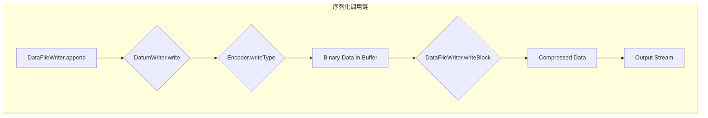

# Avro

https://gemini.google.com/app/ffa0d06bb015096b

## 基础与架构

### 简介与核心原则

本节旨在为 Apache Avro 的存在背景、核心价值主张及其与众不同的基础设计哲学提供全面的阐述。

#### 背景：Avro 在 Hadoop 生态系统中的起源

Apache Avro 是一个开源的数据序列化系统，它作为 Apache Hadoop 项目的一个子项目而诞生，由 Hadoop 的创始人 Doug Cutting 亲自操刀。它的主要动机是解决 Hadoop 默认的 Writable 序列化机制所固有的局限性，特别是其缺乏跨语言可移植性的问题，并为 Hadoop 的特定用例提供一个比 Thrift 等其他系统更健壮的替代方案。

Avro 从一开始就被设计为记录数据的首选序列化格式，尤其适用于 HDFS 中的静态数据（data-at-rest）和流处理管道中的动态数据（data-in-motion）。Avro 文件具有内在的可分割性（splittable），这对于在 MapReduce 中进行高效的并行处理至关重要。

#### 核心亮点：是什么让 Avro 成为首选？

Avro 的强大功能使其在众多数据序列化框架中脱颖而出，其核心亮点包括：

- 丰富的数据结构：Avro 支持一套全面的原生类型和复杂类型（记录、枚举、数组、映射、联合、定长），能够对几乎任何数据结构进行建模。
- 紧凑且快速的二进制格式：其二进制编码在尺寸和处理速度上都极为高效，这是大数据工作负载的一项关键要求。
- 对象容器文件格式：Avro 定义了一种用于持久化数据存储的文件格式（.avro），该格式能够嵌入 Schema，从而使文件本身具有自我描述性。
- 远程过程调用 (RPC) 框架：Avro 内置了一个 RPC 框架，支持服务间的通信。
- 卓越的 Schema 演进能力：Avro 最受赞誉的特性是其对 Schema 演进的强大支持，允许生产者和消费者以不同的速率进行迭代，而不会破坏数据管道的兼容性。这是其设计的基石。

#### 基础设计哲学：相互依存的三位一体

Avro 的核心设计并非一系列孤立的特性，而是一个由三个相互依存、紧密耦合的原则构成的系统。理解它们之间的因果关系是掌握 Avro 精髓的关键。

##### 无标签数据 (Untagged Data) 与 Schema-数据分离

与 Protocol Buffers 或 Thrift 不同，后者在序列化的载荷中嵌入了字段标识符（tag）和类型信息，而 Avro 的二进制数据是“无标签”的。载荷仅由按照 Schema 中定义的顺序连接在一起的字段值组成。

这一设计选择是 Avro 格式紧凑性的主要原因。它消除了每个记录或每个字段的元数据开销。然而，这种极致的紧凑性带来了一个必然的推论：如果数据本身不包含任何元数据，读取器如何解析它？

这个问题的答案构成了 Avro 架构的基石。由于数据流本身是模糊的，读取器必须借助写入器所使用的确切 Schema 才能正确解析数据。这不仅仅是一个特性，而是“无标签数据”设计下一个不可协商的要求。因此，“无标签数据”原则直接催生了“Schema-数据分离”原则，即 Schema 必须始终伴随数据存在，无论是嵌入在文件头中，还是在 RPC 握手期间交换。这个约束是 Avro 其他所有关键特性的逻辑起点。

##### 动态类型 (Dynamic Typing)

由于 Schema 在读取时总是可用的，Avro 不强制要求进行静态代码生成。数据可以被反序列化为通用的、类似 Map 的对象（GenericRecord），并由那些对具体数据类型一无所知的系统进行处理。

这一特性使得 Avro 成为动态语言（如 Python、Ruby）和通用数据处理框架（如 Hadoop、Spark、Flink）的理想选择。对于像 Java 这样的静态类型语言，代码生成是作为一种可选的性能优化手段提供的，而非必需。

动态类型的实现完全依赖于 Schema 的存在。当读取器拥有完整的 Schema（包含字段名、类型、文档等）时，它就拥有了解析字节流所需的所有信息。应用程序可以动态地构建数据的内存表示（例如，一个 GenericRecord），通过遍历 Schema 并从输入流中读取相应的字节来实现。因此，Schema 的可用性直接促成了动态类型，为构建通用数据处理系统提供了巨大的灵活性。

##### 符号解析 (Symbolic Resolution)，无字段 ID

当 Schema 发生演进时，Avro 通过按名称（以及别名）进行符号匹配来解析写入器 Schema 和读取器 Schema 之间的差异。这在 Protocol Buffers 和 Thrift 形成了鲜明对比，后者依赖于手动分配且不可变的整型字段 ID。

符号解析之所以可行，正是由于在读取时，写入器和读取器的完整 Schema 都存在。对于读取器 Schema 中的每个字段，Avro 会在写入器 Schema 中查找具有相同名称（或别名）的字段。由于两个 Schema 都是包含丰富元数据（如字段名）的 JSON 文档，这种直接查找成为可能。

这种设计使得字段 ID 变得多余，从而简化了 Schema 的管理（无需手动跟踪字段编号）。但其代价是，字段重命名变成了一个更加精细、需要多步骤完成的操作。

#### 对比分析：Avro vs. Protocol Buffers vs. Thrift

为了帮助架构师根据具体需求选择合适的工具，下表对这三种主流的序列化框架进行了结构化比较。

| 特性 | Apache Avro | Google Protocol Buffers | Apache Thrift |
|---|---|---|---|
| 核心哲学 | Schema 与数据分离，无标签数据，动态类型 | 紧凑、高效，通过 IDL 定义服务接口 | 跨语言服务开发，集序列化与 RPC 于一体 |
| Schema 定义 | JSON | .proto 文件 (IDL) | .thrift 文件 (IDL) |
| 代码生成 | 可选，为静态语言提供性能优化 | 强制 | 强制 |
| 数据编码 | 无标签二进制数据，需 Schema 解析 | 带标签（字段号）的二进制数据，可部分解析 | 带标签的二进制数据，支持多种协议 |
| Schema 演进 | 通过名称匹配解析读写 Schema，支持别名 | 通过字段号匹配，添加/删除可选字段简单 | 通过字段号匹配，与 Protobuf 类似 |
| 字段重命名 | 支持，但需通过别名进行多步操作 | 不支持（字段号不可变） | 不支持（字段号不可变） |
| RPC 支持 | 内置完整的 RPC 框架 | 仅定义服务接口，无内置实现 | 内置完整的 RPC 框架和服务器 |
| 语言支持 | 广泛，特别适合动态语言 | 广泛，官方支持 C++, Java, Python, Go 等 | 最广泛，支持 C++, Java, Python, Go, C#, Ruby 等 |
| 生态集成 | Hadoop/Kafka 生态系统的首选格式 | 广泛用于 Google 内部及 gRPC | 曾广泛用于 Facebook，现为 Apache 项目 |

### 架构蓝图

本节将可视化 Avro 的高级结构，展示其核心组件在关键流程中的交互方式。
Apache Avro 文件是一种基于行的存储格式，它将数据与其模式（Schema）一起存储，从而实现强大的数据序列化和模式演进能力。一个 Avro 文件（通常以 `.avro` 为后缀）的结构设计得非常紧凑和高效。

#### Apache Avro 文件结构核心概念

一个 Avro 文件包含两个主要部分：

1. **文件头 (File Header):** 包含了文件的元数据，例如 Schema 和用于压缩数据块的编解码器类型。
2. **数据块 (Data Blocks):** 一个或多个连续的数据块，其中存储了序列化后的对象。

这种结构使得 Avro 文件是**可分割的 (Splittable)**，非常适合在像 Hadoop HDFS 这样的分布式文件系统上进行大规模并行处理（例如 MapReduce）。

以下是Avro文件结构的层次示意图：

```
Avro File (.avro)
├── File Header
│   ├── Magic Number "Obj" + version 1 (4 bytes)
│   ├── File Metadata (Map)
│   │   ├── Key: "avro.schema"
│   │   │   └── Value: Schema in JSON format
│   │   ├── Key: "avro.codec" (Optional)
│   │   │   └── Value: Name of the compression codec (e.g., "snappy", "deflate")
│   │   └── ... (Other metadata key-value pairs)
│   └── Sync Marker (16 bytes, randomly generated)
├── Data Block 1
│   ├── 块内对象数量 (long)
│   ├── 块的总字节大小 (long)
│   ├── 序列化并压缩后的数据 (Binary data for multiple rows)
│   └── 16字节的同步标记 (16 bytes, same as in header)
├── Data Block 2
│   ├── Number of objects in block (long)
│   ├── Size of block in bytes (long)
│   ├── Serialized Objects (Binary data for multiple rows)
│   └── Sync Marker (16 bytes, same as in header)
├── ... (Other Data Blocks)
└── Data Block N
    ├── Number of objects in block (long)
    ├── Size of block in bytes (long)
    ├── Serialized Objects (Binary data for multiple rows)
    └── Sync Marker (16 bytes, same as in header)
```

##### 1. 文件头 (File Header)

文件头是文件的起始部分，包含了后续解码数据所需的所有信息。

- **起始标记 (Magic Number):**
    - 固定的4个字节：`'O', 'b', 'j', 1` (ASCII码)。
    - `Obj` 来自 "Object Container File" 的缩写，版本号为 `1`。
    - 这个标记用于快速识别文件是否为 Avro 格式。
- **文件元数据 (File Metadata):**
    - 这是一个 Avro `map` 类型，存储了一系列的键值对。
    - **`avro.schema` (必需):** 这是最重要的元数据。它的值是一个 JSON 字符串，定义了文件中存储数据记录的 Schema。读取器 (Reader) 必须使用这个 Schema 来正确解析二进制数据。
    - **`avro.codec` (可选):** 如果数据块被压缩，这个元数据会存在。它的值是一个字符串，指明了所使用的压缩算法，例如：
        - `null`: 不压缩 (默认)
        - `deflate`: DEFLATE 算法
        - `snappy`: Google Snappy 压缩
        - `bzip2`: Bzip2 压缩
        - `zstandard`: Zstandard 压缩
- **同步标记 (Sync Marker):**
    - 一个16字节的、随机生成的唯一标记
    - 这个标记紧跟在文件头之后，并且会重复出现在每个数据块的末尾。
    - 它的作用是允许在文件流中快速定位和同步到数据块的边界。这使得 Avro 文件可以被高效地分割处理。

##### 2. 数据块 (Data Blocks)

文件头之后是一个或多个数据块。每个数据块都包含了一定数量的记录。

- **块内对象数量:**
    - 一个 `long` 类型整数，表示这个数据块中包含了多少个 Avro 对象（记录）。
- **块的总字节大小:**
    - 一个 `long` 类型整数，表示紧随其后的序列化数据的大小（在压缩之后，如果有压缩的话）。
- **序列化数据 (Serialized Data):**
    - 这是数据块的核心。它包含了多个根据文件头中 `avro.schema` 定义的 Schema 进行二进制序列化的对象。
    - 如果 `avro.codec` 指定了压缩算法，这部分数据会被整体压缩。
    - **重点:** 序列化时**不会**为每条记录都重复写入字段名或类型信息。它仅仅是按照 Schema 的规定，紧凑地排列二进制数据，这也是 Avro 高效的原因之一。
- **同步标记 (Sync Marker):**
    - 每个数据块的末尾都附有一个与文件头中完全相同的16字节同步标记。
    - 当处理一个大文件时，处理器可以在文件流的任意位置开始读取，通过寻找这个同步标记来定位到下一个数据块的起始位置，从而实现并行处理和数据恢复。

#### 高级架构：组件与交互

Avro 系统围绕几个关键抽象构建而成：

- Schema：基于 JSON 的数据结构定义，是整个系统的契约。
- 数据模型 (Data Model)：数据的内存表示，例如 GenericRecord（通用记录）或 SpecificRecord（特定记录）。
- DatumWriter/Reader：内存数据模型与编码格式之间的桥梁。它们遍历 Schema 来序列化或反序列化数据。
- Encoder/Decoder：负责将原生类型写入字节流或从字节流中读取原生类型的底层组件，例如 BinaryEncoder、JsonEncoder。
- 容器文件 (DataFileWriter/Reader)：处理持久化 .avro 文件结构的组件，包括文件头、数据块和同步标记。

#### Schema 的核心地位

Schema 是 Avro 的核心。它在每个阶段都发挥着至关重要的作用：代码生成（可选）、序列化（用于验证和结构化）以及反序列化（用于解释和演进）。没有 Schema，Avro 的设计哲学便无从谈起。

#### 序列化与反序列化流程

DataFileReader 负责读取数据块，DatumReader 使用 Decoder 来读取原生类型，而 ResolvingDecoder（一个特殊的 Decoder）则负责处理 Schema 演进的复杂逻辑。

### Avro Schema 权威指南

本节根据官方规范，为定义 Avro Schema 提供了完整的参考，涵盖了每种类型和属性。

#### Schema 声明：结构与核心属性

一个 Avro Schema 可以由一个 JSON 字符串（用于原生类型或已定义的命名类型）、一个 JSON 对象（用于复杂类型）或一个 JSON 数组（用于联合类型）来表示。

对于命名类型 (record, enum, fixed)，其 JSON 对象包含以下核心属性：

- type: Schema 的类型，例如 "record"。
- name: 类型的名称，必需。
- namespace: 一个可选的字符串，用于限定名称以避免冲突。类型的全名是 namespace.name。
- doc: 一个可选的字符串，用于提供文档说明。
- aliases: 一个可选的 JSON 字符串数组，为 Schema 演进（重命名）提供备用名称。

对于 record 类型中的字段 (fields)，其 JSON 对象包含以下属性：

- name: 字段的名称，必需。
- type: 字段的 Schema。
- doc: 字段级别的文档说明。
- default: 默认值，对于在 Schema 演进中添加新字段以保持向后兼容性至关重要。如果字段类型是联合类型，默认值的数据类型必须与联合中的第一个类型匹配。
- order: 指定排序顺序，可选值为 "ascending" (默认), "descending", 或 "ignore"。
- aliases: 字段的备用名称。

#### 原生数据类型

这些是构成 Schema 的基础构建块：

- null: 空值
- boolean: 布尔值
- int: 32 位有符号整数
- long: 64 位有符号整数
- float: 32 位单精度浮点数
- double: 64 位双精度浮点数
- bytes: 8 位无符号字节序列
- string: Unicode 字符序列

#### 复杂数据类型

以下是 Avro 支持的六种复杂类型，每种都有其特定的属性和用途：

- record: 字段的集合，fields 属性是一个必需的字段对象数组。
- enum: 符号的固定集合，symbols 属性是一个必需的字符串数组。
- array: 单一类型项目的序列，items 属性指定了元素的 Schema。
- map: 键值对集合。键必须是字符串，values 属性指定了值的 Schema。
- union: 多种类型之间的选择，表示为一个 Schema 的 JSON 数组。对于定义可选字段（例如 ["null", "string"]）和实现多态性至关重要。联合类型不能直接包含其他联合类型。
- fixed: 固定大小的二进制数据类型。size 属性是一个必需的整数，指定字节数。

下表为开发人员编写 Avro Schema 提供了单一、统一的参考。

| 类型      | JSON 定义示例                                           | 必需属性                | 可选属性                             | 描述          |
| ------- | --------------------------------------------------- | ------------------- | -------------------------------- | ----------- |
| null    | "null"                                              | type                | 无                                | 表示空值        |
| boolean | "boolean"                                           | type                | 无                                | 表示布尔值       |
| int     | "int"                                               | type                | 无                                | 32 位有符号整数   |
| long    | "long"                                              | type                | 无                                | 64 位有符号整数   |
| float   | "float"                                             | type                | 无                                | 32 位浮点数     |
| double  | "double"                                            | type                | 无                                | 64 位浮点数     |
| bytes   | "bytes"                                             | type                | 无                                | 字节序列        |
| string  | "string"                                            | type                | 无                                | Unicode 字符串 |
| record  | {"type": "record", "name": "User", "fields": [...]} | type, name, fields  | namespace, doc, aliases          | 命名字段的集合     |
| enum    | {"type": "enum", "name": "Suit", "symbols":}        | type, name, symbols | namespace, doc, aliases, default | 符号的枚举       |
| array   | {"type": "array", "items": "string"}                | type, items         | 无                                | 同一类型元素的列表   |
| map     | {"type": "map", "values": "long"}                   | type, values        | 无                                | 字符串键到值的映射   |
| union   | ["null", "string"]                                  | (隐式)                | 无                                | 多种类型之一      |
| fixed   | {"type": "fixed", "name": "md5", "size": 16}        | type, name, size    | namespace, aliases               | 固定大小的二进制数据  |

#### 逻辑类型

逻辑类型为底层的 Avro 原生类型增加了更高级别的语义。它们通过在 Schema 中添加一个 logicalType 属性来实现。旧版本的 Avro 会忽略逻辑类型，只看到其底层的原生类型，从而确保了向后兼容性。

下表清晰地展示了从概念数据类型到其在 Avro 中物理表示的映射，这对于正确实现至关重要。

| 逻辑类型名称           | 语义表示      | 底层 Avro 类型    | 物理表示               | 示例 Schema                                                               |
| ---------------- | --------- | ------------- | ------------------ | ----------------------------------------------------------------------- |
| decimal          | 任意精度的定点小数 | bytes 或 fixed | 二进制补码表示的数值         | {"type": "bytes", "logicalType": "decimal", "precision": 4, "scale": 2} |
| uuid             | 通用唯一标识符   | string        | 字符串形式的 UUID        | {"type": "string", "logicalType": "uuid"}                               |
| date             | 日期（无时间）   | int           | 从 Unix 纪元开始的天数     | {"type": "int", "logicalType": "date"}                                  |
| time-millis      | 时间（毫秒精度）  | int           | 从午夜开始的毫秒数          | {"type": "int", "logicalType": "time-millis"}                           |
| time-micros      | 时间（微秒精度）  | long          | 从午夜开始的微秒数          | {"type": "long", "logicalType": "time-micros"}                          |
| timestamp-millis | 时间戳（毫秒精度） | long          | 从 Unix 纪元开始的毫秒数    | {"type": "long", "logicalType": "timestamp-millis"}                     |
| timestamp-micros | 时间戳（微秒精度） | long          | 从 Unix 纪元开始的微秒数    | {"type": "long", "logicalType": "timestamp-micros"}                     |
| duration         | 持续时间      | fixed(12)     | 3个4字节无符号整数（月、天、毫秒） | {"type": "fixed", "size": 12, "logicalType": "duration"}                |

### Avro API：数据表示模型

本节比较了 Avro 在 Java 中提供的三种不同的编程模型，并指导开发人员根据其用例选择合适的模型。

#### 三种范式：概述

Avro 为在 Java 中表示数据提供了三种截然不同的 API：Generic、Specific 和 Reflect。它们之间的选择是在性能、类型安全和开发便利性之间的权衡。

#### Generic API (org.apache.avro.generic)

- 描述：使用 GenericRecord 来表示数据，它本质上是一个类似 Map 的结构，通过字符串名称访问字段：record.get("fieldName")。
- 优点：
    - 无需代码生成。
    - 高度灵活；只要在运行时提供 Schema，就可以处理任何数据。
    - 是通用数据处理工具、ETL 管道和动态系统的理想选择。
- 缺点：
    - 没有编译时类型安全（字段名称的拼写错误会导致运行时错误）。
    - 由于按名称查找字段以及原生类型的装箱/拆箱，性能通常较慢。
    - 使用起来可能比较繁琐（例如，需要处理 Utf8 而非 String 对象）。

#### Specific API (org.apache.avro.specific)

- 描述：需要使用 avro-tools.jar 或构建插件（如 avro-maven-plugin）从 Schema（.avsc）文件生成代码。
- 实现：生成带有类型安全 getter 和 setter 的 POJO（例如 User.java），如 user.getName() 和 user.setFavoriteNumber(10)。
- 优点：
    - 完全的编译时类型安全。
    - 由于直接访问字段且没有装箱操作，性能明显优于 Generic API。
    - 在应用程序代码中使用起来更方便。
- 缺点：
    - 需要在构建时增加代码生成步骤。
    - 对于纯粹的通用数据处理器来说灵活性较差，因为特定的类必须存在于类路径中。

#### Reflect API (org.apache.avro.reflect)

- 描述：在运行时使用 Java 反射从现有的 Java 类（POJO）生成 Schema。允许序列化现有的应用程序对象，而无需修改或代码生成。
- 实现：使用 @Nullable 和 @Stringable 等注解来控制 Schema 的生成。
- 优点：
    - 易于与现有代码库集成。
    - 无需维护单独的 .avsc 文件或代码生成步骤。
- 缺点：
    - 由于反射开销，通常性能最慢。
    - 对生成的 Schema 的控制较少。
    - 处理复杂类型（如 Java 泛型）时可能会遇到问题。
    - 官方文档不推荐在新系统中使用此 API，仅建议其作为遗留代码的过渡桥梁。

API 的选择不仅仅是开发风格的问题，它对性能和可维护性有着深远的影响。例如，LinkedIn 开发的 avro-fastserde 库旨在通过在运行时为 Generic API 生成快速路径序列化代码来弥合性能差距，从而在不进行构建时代码生成的情况下，赋予其接近 Specific API 的性能。这一事实表明，Generic API 的性能损失在规模化应用中是一个显著的现实问题。因此，API 的选择应是一个深思熟虑的架构决策。对于性能关键路径，首选应是 Specific API，或使用 avro-fastserde 等性能增强库来增强 Generic API。标准的 Generic API 最适合非关键路径或灵活性至上的工具。

下表为 Java 开发人员提供了一个清晰、简洁的指南，以根据其具体需求选择正确的 API。

| 标准 | Generic API | Specific API | Reflect API |
|---|---|---|---|
| 性能 | 较慢 | 最快 | 最慢 |
| 类型安全 | 无（运行时检查） | 编译时检查 | 无（运行时检查） |
| 易用性 | 繁琐（类似 Map） | 非常方便（POJO） | 方便（使用现有 POJO） |
| 灵活性 | 最高 | 较低 | 中等 |
| 代码生成 | 不需要 | 需要 | 不需要 |
| 理想用例 | ETL工具、通用数据处理框架、动态 Schema 系统 | 性能敏感的应用程序、类型已知的业务逻辑 | 快速集成现有遗留 Java 代码库 |

## 源码与流程深度剖析

本部分是技术报告的核心，为 Avro 的主要操作提供了详细的、逐行级别的 Java 源码分析。

### 序列化流程：从对象到字节

本节将解构写入一个 Avro 对象容器文件的过程，从高层 API 调用一直追溯到底层的原始字节操作。

#### DataFileWriter：文件创建的协调者

DataFileWriter 是负责管理 .avro 文件结构的高级类。它处理文件头、数据块、压缩和同步标记。它扮演着协调者的角色，将实际的数据编码工作委托给其他组件。

##### 源码分析: create(Schema schema, File file)

此方法初始化写入过程。

1. 断言与初始化: 首先，通过 assertNotOpen() 确保写入器尚未打开。然后，它将传入的 schema 存储起来，并调用 setMetaInternal 将 Schema 的 JSON 字符串表示存入元数据中，键为 avro.schema。
2. 同步标记: 调用 generateSync() 生成一个随机的 16 字节同步标记。如果用户提供了 sync 字节数组，则使用用户提供的。
3. 写入文件头: 调用 init(outs) 方法，该方法负责将文件头写入底层的 OutputStream。文件头结构如下：
   - 4 字节的魔术数字 Obj\x01。
   - 文件元数据 meta Map。这个 Map 必须包含 avro.schema 和 avro.codec（例如 "snappy", "deflate", 或 "null"）。
   - 16 字节的同步标记。
4. 打开写入器: 最后，将 isOpen 标志设置为 true，表示文件已准备好接收数据。

##### 源码分析: append(D datum)

这是写入记录的主要方法。其调用链是 Avro 序列化的核心机制：`DataFileWriter.append() -> DatumWriter.write() -> BinaryEncoder.write<Type>()`。

1. 状态检查: assertOpen() 确保文件已打开。
2. 序列化到缓冲区: append 方法的核心是调用 dout.write(datum, vout)。这里的 dout 是 DatumWriter 实例，而 vout 是一个内部的 BinaryEncoder，它将数据写入一个内存中的 ByteArrayOutputStream（即 buffer）。
3. 块计数与大小检查: 每追加一条记录，blockCount 递增。然后检查内部缓冲区的大小...

##### 源码分析: writeBlock()

当当前数据块已满或手动调用 sync() 时，会调用此方法。

1. 检查块内容: 如果 blockCount > 0，说明当前块中有数据需要写入。
2. 刷写内部编码器: vout.flush() 将 BinaryEncoder 内部可能存在的缓冲数据完全写入 buffer（ByteArrayOutputStream）。
3. 压缩数据: 将 buffer 中的未压缩数据传递给配置的 Codec 进行压缩，得到压缩后的字节 compressed。
4. 写入块头和数据:
   - 向底层输出流 out 写入块中的记录数（blockCount，一个 long）。
   - 写入压缩后数据的字节大小（compressed.length，一个 long）。
   - 写入压缩后的数据本身 compressed。
5. 写入同步标记: 在数据块之后，写入 16 字节的同步标记 sync。
6. 重置状态: 重置 buffer 和 blockCount，为下一个数据块做准备。

下图直观地展示了 DataFileWriter.append() 的调用序列，阐明了文件级逻辑 (DataFileWriter)、对象到原生类型逻辑 (DatumWriter) 和原生类型到字节逻辑 (Encoder) 之间的关注点分离。



#### DatumWriter 家族：对象的翻译官

DatumWriter 是一个接口，其核心方法是 `void write(D datum, Encoder out)`。它负责同时遍历内存中的数据对象和 Schema，并将对象的字段转换为对 Encoder 的一系列调用。

##### 源码分析: GenericDatumWriter.write(Schema schema, Object datum, Encoder out)

这是序列化的核心递归方法。它是一个基于 `schema.getType()` 的大型 switch 语句。

- case RECORD: 遍历记录 Schema 的所有字段。对于每个 `Schema.Field f`，它从 `GenericRecord` 中获取相应的值（`getData().getField(datum, f.name(), f.pos())`），然后进行递归调用：`write(f.schema(), fieldValue, out)`。
- case ENUM: 获取枚举符号的序数，并调用 `out.writeEnum(data.getEnumOrdinal(datum))`。
- case ARRAY: 获取集合的大小，调用 `out.writeArrayStart()` 和 `out.setItemCount()`，然后遍历所有元素，对每个元素进行递归调用 `write(itemSchema, element, out)`。最后调用 `out.writeArrayEnd()`。
- case MAP: 与数组类似，但遍历键值对。将每个键作为字符串写入，然后对值进行递归写入。
- case UNION: 调用 `resolveUnion(schema, datum)` 确定给定数据属于联合类型中的哪个分支，然后用 `out.writeIndex()` 写入分支的索引，最后对该分支对应的 Schema 进行递归 `write()` 调用。
- case INT: 调用 `out.writeInt((Integer) datum)`。
- case STRING: 调用 `out.writeString((CharSequence) datum)`。
- 其他原生类型也类似地直接调用 Encoder 的相应方法。

##### 源码分析: SpecificDatumWriter.java

SpecificDatumWriter 继承自 GenericDatumWriter，并为特定的优化重写了部分方法。

- writeEnum(): 如果 datum 是 Java 的 Enum 类型，它不通过通用的名称查找，而是直接调用 `((Enum) datum).ordinal()` 来获取序数，这是一种性能优化。
- writeString(): 它能处理“可字符串化”的对象。如果一个对象的类被 SpecificData 标记为 `isStringable()`，它会先调用该对象的 `.toString()` 方法，然后再写入字符串。
- writeField(): 在写入字段值之前，它增加了处理 LogicalType 转换的逻辑。

这种 SpecificDatumWriter 继承 GenericDatumWriter 的设计是模板方法模式的经典应用。基类提供了整体的递归遍历算法 (write)，而子类可以重写特定的钩子方法 (writeRecord, writeEnum) 来提供更高效、类型特定的实现。

#### BinaryEncoder：原始数据的写入者

Encoder 是最低级别的组件。BinaryEncoder 实现了 Avro 规范中定义的具体字节级编码规则。

##### 源码分析: writeInt(int n) 和 writeLong(long n)

这些方法实现了可变长度的 Zig-Zag 编码。

标准的二进制补码表示法对于可变长度编码来说效率低下，因为小的负数（如 -1）其最高有效位为 1，这使得它们看起来像一个非常大的无符号数。Zig-Zag 编码的目标是将小的有符号整数（无论正负）映射到小的无符号整数。

其机制是将符号位移动到最低有效位。对于 32 位整数 n，操作为 `(n << 1) ^ (n >> 31)`。

- 0 映射为 0
- -1 映射为 1
- 1 映射为 2
- -2 映射为 3
- ... 依此类推，在正数和负数之间“之”字形前进。

然后，这个结果无符号整数使用 Varint（可变长度整数）格式进行编码。它一次编码 7 位，从最低有效位到最高有效位。每个字节的第 8 位（最高有效位）用作“连续位”。如果为 1，表示后面还有更多字节；如果为 0，表示这是该整数的最后一个字节。BinaryEncoder.java 中的源码通过位移和掩码操作直接实现了这一逻辑。

##### 源码分析: writeString(CharSequence str)

字符串被编码为 bytes 类型。writeString 方法首先将字符串转换为 UTF-8 字节数组，然后调用 writeBytes。writeBytes(byte bytes,...) 方法会先调用 `writeLong(bytes.length)` 写入字节长度，然后写入 UTF-8 编码的原始字节。这意味着每个字符串都以其字节长度作为前缀。

### 反序列化流程与 Schema 演进

本节与序列化过程相对应，解释 Avro 如何读取容器文件、重构对象，并无缝地处理 Schema 差异。

#### DataFileReader：容器文件的读取者

DataFileReader 是 DataFileWriter 的对应物。它读取文件头，理解块结构，并使用同步标记进行定位和恢复。它实现了 Iterator 接口，使得流式处理记录变得非常容易。

##### 源码分析: DataFileReader 构造函数 / openReader()

1. 初始化: 构造函数通过调用内部的 `initialize()` 方法来读取文件头。
2. 读取文件头:
   - 读取并验证 4 字节的魔术数字 `Obj\x01`。
   - 读取元数据 Map，并解析 `avro.schema` 和 `avro.codec` 的值。解析出的 Schema 成为写入器 Schema（在 DatumReader 中称为 actual Schema）。
   - 读取并存储 16 字节的同步标记。
3. 定位: 构造函数最后会调用 `blockFinished()`，为读取第一个数据块做准备。

##### 源码分析: hasNext() 和 next(D reuse)

- hasNext(): 检查是否还有未读完的记录或数据块。
- next(): 这是核心的读取方法。

1. 块检查: 如果当前块的所有记录都已被读取（`blockRemaining == 0`），它会调用 `nextBlock()` 来准备下一个块。
2. nextBlock(): 此方法首先可能会通过 `sync()` 定位到下一个同步标记。然后，它读取块的记录数和字节数。它将（可能被压缩的）数据块读入内存缓冲区，并使用配置的 Codec 对其进行解压。最后，它创建一个 BinaryDecoder 来从这个解压后的缓冲区中读取数据。
3. 反序列化记录: next() 方法最终调用 `reader.read(reuse, decoder)`，其中 reader 是 DatumReader，从当前块的缓冲区中反序列化单个记录。

`next(D reuse)` 模式是一个至关重要的性能优化。通过传入一个先前已反序列化的对象，DatumReader 可以重用该对象并填充其字段，而不是为每个记录都分配一个新对象。这在处理大型文件时，极大地减少了垃圾回收的开销。

#### DatumReader 与 Schema 解析

DatumReader 负责根据 Schema 读取数据。其最强大的能力是解析写入数据时使用的 Schema（写入器 Schema）与应用程序期望的 Schema（读取器 Schema）之间的差异。

##### 源码分析: GenericDatumReader.read(D reuse, Decoder in)

公共的 read 方法是入口点。它持有两个 Schema：actual（写入器 Schema，来自文件头）和 expected（读取器 Schema，由应用程序提供）。

Schema 演进的关键在于，它不直接使用原始的 Decoder (in)。相反，它创建了一个 ResolvingDecoder。

1. 获取解析器: `resolver = getResolver(actual, expected)`。这个工厂方法创建了一个包装了原始 Decoder 的 ResolvingDecoder。ResolvingDecoder 在构造时同时接收写入器和读取器的 Schema，并包含了预先计算好的、用于在两者之间进行转换的逻辑。
2. 配置解析器: `resolver.configure(in)` 将解析器与底层的输入 Decoder 关联起来。
3. 递归读取: 然后，它调用其内部的、递归的 `read(Object reuse, Schema expected, ResolvingDecoder in)` 方法，传入读取器 Schema和解析解码器。

##### 源码分析: ResolvingDecoder

ResolvingDecoder 是 Schema 演进的核心。它充当原始二进制数据和 DatumReader 之间的智能中介。它是一个特殊的 Decoder，当被要求读取一个值时（例如 `readInt()`），它知道如何处理 Schema 不匹配的情况。

- 机制: ResolvingDecoder 使用由 ResolvingGrammarGenerator 生成的预计算“文法”。这个文法是一系列动作，告诉解码器在每一步该做什么。
- 如何处理差异:
    - 写入器有、读取器无的字段：ResolvingDecoder 的文法会包含一个“跳过”动作。当 DatumReader 尝试读取下一个字段时，ResolvingDecoder 会从底层解码器中消费并丢弃这个多余字段的数据。
    - 写入器无、读取器有的字段：DatumReader 会请求读取该字段。ResolvingDecoder 发现这个字段在写入器的数据流中不存在。它会检查读取器 Schema 中该字段是否有 default 值。如果有，它就“生成”这个默认值并返回给 DatumReader。如果没有，则抛出 AvroTypeException。
    - 字段重排：DatumReader 按照读取器 Schema 的顺序请求字段。然而，ResolvingDecoder 按照写入器 Schema 的顺序从数据流中读取数据。它在内部对数据进行重新排序，以匹配读取器的期望。`readFieldOrder()` 等方法允许读取器在需要时了解写入器的顺序。
    - 类型提升：如果写入器写入了一个 int，但读取器期望一个 long，ResolvingDecoder 的 `readLong()` 方法会调用底层解码器的 `readInt()`，然后将结果向上转型为 long。

### RPC 框架

本节详细介绍 Avro 内置的远程过程调用机制，重点关注实现 Schema 感知通信的关键握手过程。

#### 协议定义与线路格式

Avro RPC 使用协议 (Protocol) 来定义，通常指定在一个 .avpr JSON 文件中。一个协议定义包括：

- protocol: 协议名称。
- namespace: 命名空间。
- doc: 文档说明。
- types: 协议中使用的类型定义列表（任何记录、枚举等）。
- messages: 一个消息映射，定义了可调用的远程方法。

每个 message 定义了：

- request: 请求 Schema，一个命名字段参数的数组。
- response: 响应 Schema。
- errors: 一个可选的 union Schema，用于声明可能抛出的异常。
- one-way: 一个可选的布尔值，如果为 true，则表示消息是单向的，没有响应。

#### 握手过程：源码级分析

在进行任何 RPC 调用之前，客户端和服务器必须交换协议，以确保它们能够理解对方的消息。这个握手过程被设计得非常高效，通常通过使用哈希值来避免传输完整的完整协议文本。

##### 线路格式组件

握手过程使用两个特定的记录类型：`org.apache.avro.ipc.HandshakeRequest` 和 `org.apache.avro.ipc.HandshakeResponse`。

- HandshakeRequest: 包含 `clientHash`（客户端协议的 MD5 哈希）、`serverHash`（客户端猜测的服务器协议哈希）和一个可选的 `clientProtocol`（完整的 JSON 字符串）。
- HandshakeResponse: 包含一个 `match` 枚举 (`BOTH`, `CLIENT`, `NONE`)、一个可选的 `serverProtocol` 和一个可选的 `serverHash`。

##### 握手流程分析

1. 客户端发起: 客户端发送一个 HandshakeRequest。初始时，`clientProtocol` 为 null。它发送自己协议的哈希值 (`clientHash`) 和对服务器哈希的最佳猜测 (`serverHash`)。如果是第一次连接，它可能会发送自己的哈希作为猜测值。
2. 服务器接收并响应: 服务器比较这些哈希值。
   - 情况 1: `match = BOTH`。这是最理想的情况。客户端的 `serverHash` 与服务器的实际协议哈希匹配，并且服务器识别 `clientHash`（它以前见过这个客户端协议）。服务器响应 `match: "BOTH"` 和 `serverProtocol: null`。握手完成。实际的 RPC 调用数据紧随此响应之后。
   - 情况 2: `match = CLIENT`。服务器识别 `clientHash`，但客户端的 `serverHash` 是错误的。服务器响应 `match: "CLIENT"`、完整的 `serverProtocol` 文本和正确的 `serverHash`。握手仍然被认为是完成的，RPC 响应数据紧随其后。客户端现在有责任更新其缓存的服务器协议。
   - 情况 3: `match = NONE`。服务器不识别 `clientHash`。握手失败。服务器响应 `match: "NONE"`。如果客户端的 `serverHash` 也是错误的，服务器可能还会附上其正确的协议/哈希。
1. 客户端对 NONE 的反应: 客户端现在必须重新发送其请求。这一次，它在 HandshakeRequest 中填充 `clientProtocol` 字段，附上其完整的协议文本。服务器在收到带有非空协议的请求后，会缓存它，并保证以 `match: "BOTH"` 响应，从而完成握手。

## 实践应用与高级主题

### 配置与性能调优

本节为在实际应用中优化 Avro 性能提供了可操作的建议。

#### 关键配置参数

- DataFileWriter.setSyncInterval(bytes): 控制数据块的大致大小，默认为 16 KB。较小的间隔意味着更多的同步标记，从而获得更好的可分割性和恢复能力，但存储开销更高。较大的间隔在空间上更高效，但对于并行处理的粒度较粗。文档建议值在 2KB 到 2MB 之间。调整此参数是在存储效率和并行处理粒度之间的权衡。
- EncoderFactory.configureBufferSize(bytes): 设置带缓冲的编码器的缓冲区大小。更大的缓冲区可以通过减少对底层流的写入次数来提高吞吐量，但会消耗更多内存。
- DataFileWriter.setCodec(CodecFactory): 配置数据块的压缩编解码器。这是最重要的性能杠杆之一。

#### 性能优化策略

##### 对象重用

如前所述，在迭代 DataFileReader 时，始终使用 `reader.next(reuse)` 模式可以避免大量的垃圾回收开销。类似地，Decoder 和 Encoder 实例可以通过 DecoderFactory 和 EncoderFactory 进行重用，以避免对象创建的开销，尽管这通常由像 AvroCoder 这样的库使用 ThreadLocal 变量来处理。

##### 选择合适的压缩编解码器

Avro 支持 null (不压缩)、deflate (类似 Gzip)、snappy、bzip2 和 zstandard (自 1.9.0 起)。

一个常见的误解是，使用像 Gzip 这样的不可分割编解码器会使 Avro 文件不可分割。这是错误的。因为 Avro 在块级别应用压缩，所以无论块内使用何种编解码器，整个 .avro 文件在同步标记处仍然是可分割的。这是相比于简单地 Gzip 一个大文本文件的主要优势。

下表帮助工程师根据其特定工作负载在 CPU、存储和速度之间做出明智的压缩权衡。

| 编解码器 | 压缩比 | 压缩速度 | 解压速度 | CPU 使用率 | 理想用例 |
|---|---|---|---|---|---|
| null | 无 | 最快 | 最快 | 最低 | CPU 密集型任务，数据本身已不可压缩 |
| deflate | 较高 | 较慢 | 中等 | 较高 | “冷”数据归档，存储成本是主要考虑因素 |
| snappy | 中等 | 非常快 | 非常快 | 较低 | “热”数据、流处理，CPU 是瓶颈 |
| bzip2 | 最高 | 最慢 | 最慢 | 最高 | 长期归档，对压缩比要求极致 |
| zstandard | 高 | 快 | 非常快 | 中等 | 平衡的选择，适用于大多数现代工作负载 |

##### API 选择 (Specific vs. Generic)

由于避免了反射、Map 查找和对象装箱，使用 Specific API 比 Generic API 提供了显著的性能提升。对于高吞吐量管道，这是一个关键的优化。

##### 并行化与高级库

对于极高的吞吐量，标准的 DataFileWriter 可能成为瓶颈。像 fast-avro-write 这样的库通过并行化记录块的序列化来解决这个问题，这表明标准写入器的单线程特性在规模化应用中是一个已知的性能限制。LinkedIn 的 avro-fastserde 则采取了不同的方法，通过动态生成反序列化代码来加速 Generic API。

### 常见陷阱与故障排查

本节旨在为诊断和解决使用 Avro 时遇到的常见问题提供实用指南。

#### 理解和解决 AvroTypeException

这是最常见的异常之一，通常在反序列化期间发生，当写入器和读取器的 Schema 之间存在无法解决的冲突时触发。

- 常见原因:
    - 缺少字段且无默认值: 字段存在于读取器 Schema 中，但不存在于写入器 Schema 中，且读取器 Schema 未提供 default 值。
    - 不兼容的类型更改: 例如，写入器是 string，而读取器期望 int。
    - 未知的联合分支: 写入器写入了一个来自联合类型某个分支的值，而读取器的 Schema 不知道该分支。这是一个典型的前向兼容性问题。
    - 枚举符号不匹配: 写入器使用了一个枚举符号，该符号在读取器的枚举定义中不存在（且读取器的枚举没有默认值）。

#### 应对 Schema 演进冲突

核心挑战在于协调独立部署的生产者和消费者之间的 Schema 变更。使用像 Confluent Schema Registry 这样的工具可以自动强制执行兼容性规则，从而极大地简化了这一过程。

- 兼容性规则:
    - BACKWARD (默认): 新 Schema 可以读取用旧 Schema 写入的数据。允许消费者在生产者之前升级。安全变更包括：删除字段、添加带默认值的可选字段。
    - FORWARD: 旧 Schema 可以读取用新 Schema 写入的数据。允许生产者在消费者之前升级。安全变更包括：添加字段、删除可选字段。
    - FULL: 同时向后和向前兼容。唯一安全的变更是添加或删除可选字段。
- Schema 演进的最佳实践:
    - 不要重命名必需字段；相反，应将新字段添加为可选字段，迁移消费者使用它，然后在后续版本中删除旧字段。
    - 始终为新字段添加 default 值，以保持向后兼容性。
    - 使用 Schema Registry 在新 Schema 版本发布前自动强制执行兼容性规则。

#### 局限性与已知问题

- 无 Schema 导入: Avro 规范不包含类似 XML Schema 的 `<import>` 或 `<include>` 机制。这可能导致庞大、单体的 Schema 文件，并使 Schema 重用复杂化。解决方法通常涉及预处理或自定义工具来从组件中组装 Schema。
- Reflect API 与 Java 泛型: Reflect API 难以正确地为参数化 Java 类型（如 `List<T>`）生成 Schema，通常需要手动提供 Schema 作为变通方法。
- 逻辑类型的支持不一致: 尽管规范定义了逻辑类型，但在不同的语言实现和工具中，支持可能不一致。例如，`duration` 类型在文档中被提及，但在 Java 库中很长一段时间内并未实现。

### Avro 的未来

本节基于最新的发布说明和社区讨论，审视了该项目的最新发展和未来方向。

#### 近期版本分析 (1.11.x, 1.12.0)

- 1.12.0 (2024年8月): 这是一个重大版本，包含了跨多种语言（尤其是 Rust）的大量错误修复和改进。关键主题包括更严格的 Schema 验证（禁止重复/无效的字段名）、改进的命名空间处理以及针对复杂嵌套类型和联合的更优 Schema 解析逻辑。Rust SDK 新增了对纳秒级精度的支持。
- 1.11.4 (2024年9月): 这是一个针对 Java 的补丁版本，主要关注安全性（AVRO-3985: Restrict trusted packages in ReflectData and SpecificData）和构建系统修复。
- 1.9.0 (2019年5月): 这是一个里程碑式的版本，引入了重大的现代化改进:
    - 将逻辑类型的时间处理从 Joda-Time 切换到 Java 8 的 `java.time` API (JSR-310)。
    - 将 JSON 解析库从 Jackson 1.x 升级到 2.x。
    - 增加了对 Zstandard (zstd) 压缩的支持。
    - 放弃了对 Hadoop 1.x 的支持。

#### 新兴趋势与未来路线图

- 跨语言成熟度: 虽然 Java 仍然是最成熟的实现，但最近的版本显示出对其他语言（特别是 Rust）的大量投入，以使其在功能和健壮性上达到同等水平。官方 Rust 实现迁移到 `avro-rs` 以及 1.12.0 版本中大量的 Rust 特定修复，都表明了在现代系统级编程中推广 Avro 的强烈意愿。
- 与其他格式/系统的互操作性: Avro 与其他数据生态系统的集成日益增多。`duckdb-avro` 扩展 和 `arrow/go/arrow/avro` 包显示出一种趋势，即在 Avro（行式存储/消息传递）和 Arrow（内存中列式分析）等格式之间实现无缝转换，弥合了两者之间的鸿沟。
- 未来方向 (从 JIRA/讨论中推断):
    - 更丰富的 Schema 语言: 长期以来，社区一直希望支持从 .avsc 文件生成 Avro IDL (.avdl) (AVRO-1757)，并拥有更好的编程方式来构建 Schema (AVRO-2211)，这表明人们渴望有更友好的方式来管理复杂的 Schema。
    - 持续的性能增强: 社区始终关注性能，`avro-fastserde` 等库的采用以及对核心组件优化的持续讨论都证明了这一点。
    - 云原生集成: 尽管在发布说明中没有明确提及，但 Avro 在 Kafka 和其他流处理平台中的广泛使用意味着，未来将继续关注支持云原生、基于微服务的架构的特性。

### 技术问答

本节将报告的关键要点综合成一系列精选的技术问题和专家解答，为读者提供快速参考摘要。

- Q1: Avro 中最重要的设计决策是什么？其后果是什么？
    - A: 无标签数据 (Untagged Data)。它直接带来了格式的紧凑性，但必然要求在读取时必须有写入器 Schema 的存在。这一要求反过来又促成了动态类型和符号字段解析。其主要后果是，一个健壮的 Schema 管理策略变得非常重要。
- Q2: 在 Java 中，我应该何时选择 Generic、Specific 或 Reflect API？
    - A: 对于性能关键且类型在编译时已知的应用程序代码，使用 Specific API。对于构建灵活的、Schema 不可知（schema-agnostic）的工具和框架，使用 Generic API。仅在作为遗留 POJO 的临时桥梁时使用 Reflect API，因为它的性能和灵活性最差。
- Q3: Schema 演进的真正工作原理是什么？ResolvingDecoder 的作用是什么？
    - A: 它通过在读取时比较写入器和读取器的 Schema 来工作。ResolvingDecoder 是实现这种比较的引擎，它充当标准解码器的智能包装器。它根据预先计算的解析文法，动态地跳过写入器中多余的字段，为读取器中缺失的字段提供默认值，并根据名称动态地重新排序字段。
- Q4: Avro 最关键的性能调优手段是什么？
    - A: 1) 选择合适的压缩编解码器以适应您的工作负载（例如，snappy 注重速度，zstd 追求平衡）。2) 使用 Specific API 或像 `avro-fastserde` 这样的 JIT 编译库，而不是标准的 Generic API。3) 实施对象重用模式（`reader.next(reuse)`）以最小化垃圾回收压力。
- Q5: 如果我使用像 Gzip 这样的不可分割编解码器，Avro 文件是否还可分割？
    - A: 是。Avro 的可分割性来自于数据块之间的同步标记，而不是编解码器。压缩是按块应用的，因此文件仍然可以在块边界处被分割和并行处理。

### 结论

Apache Avro 作为一个成熟且强大的数据序列化系统，其设计哲学——以“无标签数据”为核心，衍生出对 Schema 的强依赖，进而实现动态类型和优雅的 Schema 演进——使其在大数据和流处理领域占据了不可或缺的地位。它在数据紧凑性、处理性能和跨语言互操作性之间取得了出色的平衡。

对于架构师和工程师而言，深入理解 Avro 的内部工作原理，特别是其序列化/反序列化流程、Schema 解析机制以及不同 API 之间的性能权衡，是构建可扩展、健壮且面向未来的数据系统的关键。随着社区对 Rust 等现代语言支持的不断加强以及与 Arrow 等列式格式的日益融合，Avro 的生态系统正在不断扩展，确保了其在未来数据密集型应用中的持续 relevance 和核心价值。正确地利用其配置、性能优化策略和 Schema 演进的最佳实践，将能充分释放 Avro 在复杂数据环境中的全部潜力。
