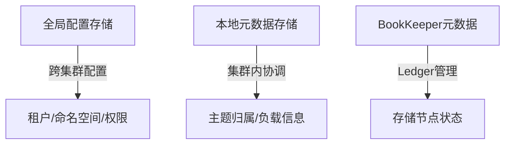

## 架构基础

### 起源与设计哲学

**从雅虎到Apache软件基金会**

Apache Pulsar的诞生源于雅虎在大规模生产环境中的实际需求。2012年，雅虎需要为其核心应用（雅虎邮箱、财经、体育等）构建一个统一的消息平台，必须应对：
- 海量数据处理
- 多团队协作
- 严苛的SLA要求

2016年开源，2018年成为Apache顶级项目，标志着业界对其云原生架构设计的高度认可。

**核心设计哲学**

Pulsar的设计目标是为解决第一代消息系统（如Kafka）在云原生时代的局限：
- ❌ 弹性伸缩困难
- ❌ 运维复杂度高  
- ❌ 多租户隔离薄弱

### 核心差异化特性

| 特性 | Pulsar | Kafka |
|---|---|---|
| **多租户** | 原生支持，逻辑+物理隔离 | 需复杂部署或第三方工具 |
| **地理复制** | 原生跨数据中心复制 | 需MirrorMaker等工具 |
| **无限存储** | 自动分层存储到S3/GCS | 受限于本地磁盘 |

### 架构对比：Pulsar vs Kafka

| 维度 | Pulsar分离式架构 | Kafka单体式架构 |
|---|---|---|
| **计算存储** | 完全解耦 | 紧密耦合 |
| **扩容** | 计算/存储独立扩展 | 必须同时扩容 |
| **数据重平衡** | 无需重平衡 | 必需且耗时 |
| **故障恢复** | 秒级恢复 | 分钟级恢复 |

### 多层架构深度解析

Pulsar采用三层分离式架构，每层独立扩展和演进：

#### 1. 服务层：无状态的Pulsar Broker

**核心职责**
```
┌─────────────────────────────┐
│        Pulsar Broker        │
├─────────────────────────────┤
│  • 处理TCP连接              │
│  • 消息路由与分派           │
│  • 与BookKeeper交互         │
│  • 集群协调                 │
└─────────────────────────────┘
```

**无状态设计优势**
- **秒级扩展**：新增Broker无需数据迁移
- **秒级故障恢复**：无数据复制过程
- **独立扩容**：计算资源按需扩展

Broker是Pulsar的“计算”层，它是一个无状态的组件，主要职责包括：

- 处理来自生产者和消费者的TCP连接。
- 将消息分派（dispatch）给消费者。
- 与存储层（BookKeeper）交互，完成消息的持久化。
- 与元数据层（ZooKeeper/etcd）通信，处理集群协调任务。

“无状态”是Broker最核心的特性。Broker自身不持久化存储任何消息数据，所有消息的真理之源（source of truth）都存放在BookKeeper中。Broker会维护一些内存中的缓存（如Managed Ledger Cache）以优化性能，但这些缓存中的数据都是可从持久化层恢复的。

这种无状态设计带来了两个巨大的好处：

1. 快速的水平扩展：当需要增加计算能力时，只需添加新的Broker节点即可。新Broker可以立即加入集群并分担负载，整个过程无需任何数据迁移或重平衡。
2. 极快的故障恢复：如果一个Broker节点宕机，其负责的主题所有权可以被集群中其他健康的Broker在数秒内接管。由于消息数据不在故障节点上，恢复过程不涉及任何数据复制，从而大大缩短了服务中断时间。
#### 2. 存储层：Apache BookKeeper与分片式日志

**分片式架构**

| 概念 | 说明 | 作用 |
|---|---|---|
| **Managed Ledger** | 逻辑主题抽象 | 管理一组有序Ledger |
| **Ledger** | 物理日志分片 | 不可变存储单元 |
| **Entry** | 最小存储单元 | 原子写入操作 |

**架构优势**
- **精确清理**：Ledger级粒度回收存储空间
- **分层存储**：密封Ledger自动卸载到对象存储
- **并行I/O**：数据条带化到多个Bookie节点

Pulsar选择使用一个独立的、成熟的分布式日志系统——Apache BookKeeper，作为其持久化存储层。BookKeeper本身就是一个高可用、低延迟、可扩展的日志存储服务。

- 分片式架构（Segment-Oriented Architecture）：这是理解Pulsar存储模型的关键。一个Pulsar主题在物理上并非一个单一的、无限增长的日志文件。它被抽象为一个“Managed Ledger”（受管日志），而一个Managed Ledger又是由一系列有序的BookKeeper“Ledger”（日志分片）组成的。在任何时候，只有一个Ledger处于活跃（open）状态，用于写入新消息；所有之前的Ledger都已被密封（sealed），成为不可变对象。
- 分片带来的优势：
    - 高效的数据保留与清理：当一个Ledger中的所有消息都被所有订阅者消费确认后，这个Ledger就可以被安全地删除，从而精确地回收存储空间。
    - 分层存储的基础：只有被密封的、不可变的Ledger才能被安全地复制到外部的长期存储系统中，这是分层存储功能实现的基础。
    - 数据条带化（Striping）：每个Ledger的条目（entry）会被条带化地写入到多个BookKeeper存储节点（称为Bookie）上，这不仅提供了数据冗余和容错，还实现了I/O负载的并行化和均衡。
#### 3. 元数据层：集群神经中枢

**两级存储设计**



**演进路线图**
- ✅ **ZooKeeper**（传统方案）
- ✅ **etcd**（Kubernetes原生，2025 LTS推荐）
- 🚀 **Oxia**（超大规模专用，百万级Topic）

元数据层负责存储和管理整个Pulsar实例的所有配置和状态信息，是集群的“神经中枢”。历史上，这一层由Apache ZooKeeper承担。

Pulsar精巧地设计了两级元数据存储：

- 本地元数据存储（Local Metadata Store）：由metadataStoreUrl参数配置。每个Pulsar集群都拥有自己独立的本地元数据存储，用于管理该集群特有的状态，例如主题分区的归属权（哪个Broker负责哪个主题）、Broker的负载报告、BookKeeper的Ledger元数据等。
- 全局配置存储（Configuration Store）：由configurationMetadataStoreUrl参数配置。它负责存储跨集群的全局配置信息，如租户、命名空间、权限策略等。在地理复制场景下，所有集群共享同一个全局配置存储，从而实现全局统一的管理视图。

从Pulsar 2.10版本开始，通过PIP-45的实现，元数据层已经演变为一个可插拔的框架，除了ZooKeeper，还支持使用etcd和Oxia等现代化的元数据后端。

### 架构的深远影响

| 维度 | 传统架构痛点 | Pulsar解决方案 |
|---|---|---|
| **弹性伸缩** | 计算存储耦合 | 独立扩展，无重平衡 |
| **容错能力** | 数据迁移耗时 | 秒级故障恢复 |
| **运维复杂度** | 分区重分配 | 自动化运维 |

> **精确理解"无状态"**：Broker维护可恢复的内存状态（缓存、元数据），但不持有主数据副本。故障时通过查询元数据和BookKeeper重建状态，解释了故障转移期间的短暂不可用。
#### 架构的深远影响：弹性、容错与运维简易性

Pulsar的分离式架构带来了深远的影响：

- 真正的弹性伸缩：计算（Broker）和存储（Bookie）可以根据实际需求独立扩展，且无需数据重平衡。需要更高的读写吞吐量？增加Broker。需要更大的存储容量或更长的保留时间？增加Bookie。这种灵活性完美契合了云原生应用的弹性需求。
- 卓越的容错能力：Broker的故障对数据持久性没有影响，对可用性的影响也极小。Bookie的故障则由BookKeeper自身的复制协议和自动恢复机制来处理，确保数据不丢失。
- 简化的运维操作：虽然Pulsar的组件更多，但某些关键的运维操作却被大大简化了。运维人员不再需要管理Broker节点的磁盘空间，也无需执行高风险的分区重分配任务。

虽然Pulsar的Broker常被描述为“无状态”，但更精确的理解是，Broker维护着大量可从持久化层（元数据存储和BookKeeper）恢复的内存状态。这些状态包括用于性能优化的Managed Ledger Cache，以及从元数据层获取的主题所有权信息。因此，“无状态”的核心含义是Broker不持有任何无法恢复的主数据副本。当Broker故障时，它需要通过查询元数据存储和BookKeeper来重建其内存状态，这解释了主题在故障转移期间短暂的不可用性。理解这一点对于精确地进行性能调优和故障分析至关重要。

## 组件与流程内幕

### Pulsar Broker：无状态的编排引擎

#### Broker内部构件：Dispatcher、REST API服务器与Managed Ledger Cache

Pulsar Broker并非一个单一功能的进程，它主要由两个核心网络组件和一个关键的性能组件构成：

1. HTTP服务器：它对外暴露一个RESTful API，用于处理所有管理类操作和初始的服务发现。无论是管理员使用pulsar-admin工具创建租户和命名空间，还是客户端首次连接时进行的Topic查找，都是通过这个HTTP接口完成的。
2. Dispatcher（分发器）：这是一个基于Netty实现的高性能、异步TCP服务器。它负责处理所有的数据平面流量，即生产者发送消息和消费者接收消息的通信。这些通信都通过Pulsar自定义的二进制协议进行，以实现最高的效率。
3. Managed Ledger Cache（受管日志缓存）：这是Broker内部至关重要的性能优化组件。它在Broker的JVM堆外内存（Direct Memory）中缓存了最近写入的消息。
    - 追尾读（Tailing Reads）：对于活跃的、正在消费最新消息的消费者，Broker会直接从这个内存缓存中读取数据并发送，完全避免了与后端存储（BookKeeper）的交互。这不仅极大地降低了消费延迟，也实现了读写操作的I/O隔离。
    - 追赶读（Catch-up Reads）：当消费者需要读取的消息已经不在缓存中时（例如，消费者离线了很长时间），Broker会触发“追赶读”，从BookKeeper中拉取历史数据。这显然是一个更慢的操作路径，因此，合理配置缓存大小（managedLedgerCacheSizeMB）对于优化消费性能至关重要。

#### Topic所有权与负载均衡：动态分配、Bundle拆分与卸载策略

为了高效管理可能多达数百万的Topic，Pulsar引入了一套精巧的所有权和负载均衡机制。

- Topic Bundle（主题包）：Pulsar并不以单个Topic作为管理和负载均衡的基本单位，而是将一个命名空间下的所有Topic逻辑上划分成若干个“Bundle”。整个Bundle，而非单个Topic，被作为一个单元分配给某个Broker。这种抽象大大减少了元数据管理的开销，是Pulsar能够支持海量Topic的关键。
- 动态所有权分配：当一个客户端（生产者或消费者）第一次尝试访问某个Topic时，它会向任意一个Broker发起查找请求。接收请求的Broker会查询元数据，确定该Topic所属的Bundle当前由哪个Broker负责（即“Owner Broker”）。如果该Bundle尚未分配，系统会根据负载均衡策略（通常是选择最空闲的Broker）为其指派一个Owner Broker，并将这个地址返回给客户端。之后，客户端会与这个Owner Broker建立直接的长连接。
- 自动化负载均衡：Pulsar内置了一个复杂的负载管理器，它持续监控集群中所有Broker的资源使用情况（如CPU、内存、网络I/O、消息速率等）。
- Bundle拆分（Splitting）：如果某个Bundle因为包含的Topic过多或流量过大而成为“热点”，负载管理器可以自动将其拆分成多个更小的Bundle。这使得负载可以更细粒度地分布到不同的Broker上。
- Bundle卸载（Shedding）：如果某个Broker的整体负载过高，超出了预设的阈值，负载管理器会触发“卸载”操作，将该Broker上的一部分Bundle的所有权转移给集群中其他负载较低的Broker。这个过程仅仅是元数据层面的所有权变更，不涉及任何消息数据的物理迁移，因此速度极快。Pulsar 4.0中引入了更多先进的卸载策略和资源管理算法（如PIP-354, PIP-358, PIP-364），进一步提升了负载均衡的智能化水平。

基于Bundle的负载均衡机制，是一种巧妙的工程抽象。它通过聚合管理，避免了对海量Topic进行逐一跟踪的元数据风暴，使得负载均衡算法在计算上可行，并极大地减轻了元数据存储的压力。因此，对于运维人员来说，理解和配置Bundle的行为（例如，一个命名空间的初始Bundle数量）是运营大规模Pulsar集群的一项核心技能。

### Apache BookKeeper：持久化的基石

Apache Pulsar 的核心架构采用了创新的两层设计，将无状态的服务层（Broker）与有状态的持久化层（Apache BookKeeper）彻底分离 。Broker 负责处理客户端连接、消息分发以及负载均衡，而 BookKeeper 则提供了一个高可用、可扩展、基于日志的持久化存储服务 。

在这一架构中，消息被写入称为“Ledger”的数据结构中。Ledger 是一种仅支持追加写入（append-only）的日志结构，其数据被复制并持久化存储在一个由多个 BookKeeper 节点（称为 Bookie）组成的集群中 。一个 Pulsar Topic 由一个或多个 Ledger 顺序组成，从而形成一个逻辑上的、无限的流 。这种设计确保了消息的持久性（通过 fsync 强制刷盘）和高可用性（通过多副本复制）。

这种计算与存储的分离是 Pulsar 最具标志性的架构特征。它不仅带来了诸多优势，如 Broker 的快速水平扩展（无需数据重平衡）、存储与计算资源的独立伸缩以及卓越的多租户隔离能力 ，更深远地影响了其高级功能的实现方式。例如，Topic Compaction 并非在原地修改数据，而是通过创建新的 Ledger 来生成压缩视图 。同样，延迟消息机制的架构演进也充分利用了 BookKeeper 的持久化能力，从一个纯内存方案演进为一个高可用的持久化索引方案 。
#### 核心概念：Ledger、Entry与Bookie

- Bookie：BookKeeper集群中的单个存储服务器节点。多个Bookie共同构成了Pulsar的持久化存储层。
- Ledger：一个可追加写入、单写入者（single-writer）的日志分片。它是BookKeeper中数据隔离和删除的基本单位。一个Pulsar Topic由一串有序的Ledger组成。
- Entry：写入Ledger的原子数据单元。Pulsar Broker对BookKeeper的每一次持久化写入操作，就是一个Entry。
#### 写入路径揭秘：Journal、Entry Log与索引

当一个Bookie接收到来自Broker的写Entry请求时，它会执行一套精心设计的I/O流程，以同时保证低延迟和高吞吐：

1. 写入Journal（日志文件）：这是确保数据持久性的关键一步。Bookie会首先将这个Entry追加到一个名为Journal的事务日志文件中。这个写入是同步的，并且Journal文件通常配置在专用的、高速的存储设备上（如NVMe SSD）。只有当Entry成功写入Journal并刷盘（fsync）后，Bookie才会向上游的Broker发送确认，这保证了数据在任何情况下都不会丢失。
2. 写入内存缓存：同时，该Entry会被放入Bookie的内存缓存（Ledger Cache）中，为后续的读操作提供加速。
3. 发送确认（ACK）：完成Journal写入后，Bookie向Broker发送ACK。
4. 异步刷入Entry Log（条目日志）：一个后台线程会周期性地将内存缓存中的Entry批量地、异步地刷入到Entry Log文件中。Entry Log通常配置在容量更大、成本更低的磁盘上（如HDD或大容量SSD）。为了最大化磁盘的顺序写性能，来自不同Ledger的Entry会在Entry Log中交错存储。
5. 更新索引：Entry在Entry Log中的物理位置（偏移量）会被记录到该Entry所属Ledger的索引文件中，以便后续能够快速定位和读取。

BookKeeper的I/O模型通过将对延迟敏感的同步写操作（Journal）和对吞吐量敏感的批量异步写操作（Entry Log）分离到不同的物理设备上，实现了极致的性能优化。这对于生产环境的部署至关重要：

为了获得最佳性能，必须为Bookie的Journal和Ledger目录配置独立的物理磁盘。将它们放在同一块磁盘上会产生严重的I/O争用，从而显著降低性能。

#### 数据一致性与复制：Ensemble、Quorum与Fencing

BookKeeper通过Quorum机制来保证数据的高可用和一致性。

- Ensemble (E)：对于一个给定的Ledger，系统会为其选择一组Bookie来存储其数据，这组Bookie被称为该Ledger的Ensemble。
- Write Quorum (Qw)：写入法定数量。它定义了每个Entry需要被复制并写入到Ensemble中的Bookie数量，即复制因子。
- Ack Quorum (Qa)：确认法定数量。它定义了必须有多少个Bookie成功返回ACK后，Broker才能认为这次写入操作是成功的。

这三者之间必须满足E >= Qw >= Qa的关系。一个典型的生产环境配置是E=3, Qw=3, Qa=2。这意味着：为Ledger选择3个Bookie（Ensemble），每个Entry都尝试写入这3个Bookie（Write Quorum），只要有2个Bookie确认写入成功（Ack Quorum），Pulsar Broker就认为消息已持久化，并可以向生产者返回成功。这样的配置可以容忍在写入期间任意一个Bookie节点发生故障。

- Fencing（隔离）：这是BookKeeper保证单写入者一致性的核心机制。当一个Ledger的写入者（即Pulsar Broker）被认为已经宕机时，集群会启动恢复流程。恢复的第一步就是对这个Ledger进行“Fencing”。恢复协调者会向该Ledger的Ensemble中的Quorum发送Fencing请求。收到请求的Bookie会将该Ledger标记为Fenced状态，并拒绝任何来自旧写入者的后续写请求。Fencing 仅限制旧写入者的写权限，不影响其他节点的读请求（确保数据可正常消费）；当新写入者被选举出来后，Bookie 会允许其发起的写请求（需先完成 Ledger 的恢复流程，如确认最后一条 Entry 的位置）。这有效防止了“脑裂”（Split-Brain）问题，即旧的、可能只是网络分区的“僵尸”写入者继续写入数据，从而破坏数据一致性。

### 元数据存储：从ZooKeeper到云原生替代品的演进

#### ZooKeeper的历史角色：本地与全局Quorum

在Pulsar的早期版本中，Apache ZooKeeper是其唯一的元数据和协调服务依赖。如前所述，Pulsar巧妙地使用了两个独立的ZK集群（Quorum）：一个本地Quorum用于集群内部的协调，一个全局Quorum用于跨集群的配置管理，这为地理复制等高级功能提供了基础。

然而，ZooKeeper也带来了挑战。其性能会随着元数据总量的增加而下降，并且为了保证低延迟，它通常要求整个数据集都能装入内存。这为Pulsar集群能够支持的Topic数量设置了一个事实上的上限。

#### PIP-45：可插拔元数据接口与无ZK的Pulsar之路

为了突破ZooKeeper的瓶颈，Pulsar社区通过Pulsar改进提案进行了一项重大的架构重构。这项工作的核心是将所有对ZooKeeper客户端API的直接调用，抽象到一个通用的MetadataStore接口之后。

这种可插拔的策略与Kafka的KRaft（将Raft共识协议内置到Broker中）形成了鲜明对比。Pulsar选择了更为灵活的开放式道路，允许用户根据其部署环境选择最合适的元数据后端，而不是将用户锁定在单一的内置实现上。在Broker启动时，可以根据配置文件broker.conf中metadataStoreUrl参数的前缀（如zk:、etcd:、rocksdb:）来动态加载和实例化不同的元数据存储实现。

#### etcd作为元数据后端：技术深度解析与生产就绪状态

为何选择etcd？对于在Kubernetes上运行的Pulsar，etcd是天然的选择。因为etcd本身就是Kubernetes控制平面的核心组件，负责存储所有集群状态。利用Kubernetes环境中已有的、高可用的etcd集群，可以免去额外部署和维护一个ZooKeeper集群的运维负担，从而极大地简化Pulsar的部署。

- 技术优势：
    - 可扩展性：etcd将数据持久化在磁盘上的b-tree中，并通过内存映射提供低延迟访问，这打破了ZooKeeper的数据必须常驻内存的限制。理论上，这能将元数据存储的容量从GB级别提升到百GB级别。
    - 性能：etcd使用Go语言编写，其Raft协议实现采用基于推送（push-based）的更新模型，相比拉取（pull-based）模型在延迟上略有优势，并且避免了Java应用中可能出现的长时间GC停顿问题。
    - 2025年生产就绪状态：截至2025年初，etcd作为Pulsar的元数据存储后端已获得官方支持并有详细文档。虽然在Pulsar 2.10版本中该功能尚处于Beta阶段，但随着Pulsar 4.0 LTS版本的发布，它已被认为是ZooKeeper的一个成熟替代方案，尤其推荐用于所有新的基于Kubernetes的部署。需要注意的是，Pulsar项目本身不提供从现有ZooKeeper集群到etcd的在线迁移工具，此类迁移需要规划停机窗口进行。社区的观点是，不同存储后端之间的数据迁移超出了Pulsar自身的核心范畴。

#### 未来展望：Oxia——为超大规模部署而生的元数据存储

如果说etcd解决了Pulsar在Kubernetes环境下的运维简化问题，那么Oxia则旨在解决终极的超大规模（hyperscale）问题。

Oxia是由StreamNative公司开发并开源的一款全新的、为元数据存储和协调而生的系统。其设计目标是支持数亿级别的Topic，提供每秒数百万次的读写吞吐能力，并能存储数百GB的元数据。Oxia通过与Pulsar相同的可插拔MetadataStore接口（PIP-335）进行集成。

在Pulsar 4.0的发布蓝图中，Oxia被定位为克服ZooKeeper和etcd最终扩展性限制的长期战略解决方案。截至2025年中，Oxia已经可用并集成，但ZooKeeper仍是默认选项。Oxia主要面向那些需要将Pulsar集群规模推向极致的用户。

Pulsar元数据层的演进，是分布式系统从依赖专用基础设施（如自建ZK集群）向拥抱云原生集成（如利用平台提供的etcd）转变的一个缩影。PIP-45的实施，使Pulsar成为了一个更好的Kubernetes“公民”，降低了其在云原生环境中的部署和运维门槛。而Oxia的出现，则展示了Pulsar社区应对未来超大规模挑战的前瞻性视野。对于2025年在Kubernetes上进行的新Pulsar部署，etcd应作为首选的元数据存储方案。

### 消息生命周期：基于源码的深度追踪

#### 发布路径：从Producer.send()到BookKeeper持久化

一条消息从生产者发出到被Pulsar持久化，经历了一个清晰且高效的流程。

1. 客户端：初始化与查找
	- 应用通过PulsarClient.newProducer()创建一个Producer实例，此过程可配置主题、批处理、压缩、路由模式等众多参数。
	- Topic查找（Lookup）：创建Producer后的第一个动作是服务发现。客户端向任意一个Broker（或Proxy）发送一个HTTP查找请求。Broker查询元数据，找到该Topic所属Bundle的Owner Broker，并将该Broker的地址返回给客户端。
	- 建立连接：客户端随后与返回的Owner Broker建立一条直接的、持久化的TCP连接，用于后续所有的数据传输。

2. 客户端：发送消息
	- 应用调用producer.send(message)（同步）或producer.sendAsync(message)（异步）发送消息。
	- 批处理（Batching）：若启用批处理（enableBatching(true)），消息不会立即发送，而是被缓存在客户端的一个队列中。当队列中的消息数量达到batchingMaxMessages、总大小达到batchingMaxBytes，或等待时间超过batchingMaxPublishDelay时，整个批次才会被作为一个请求发送出去。对于需要保证局部有序的Key_Shared订阅，使用基于Key的批处理构建器（BatcherBuilder.KEY_BASED）至关重要，它能确保相同Key的消息被打包在同一个批次中。
	- 分块（Chunking）：对于超过Broker允许最大值的超大消息，客户端可以启用分块（enableChunking(true)）。生产者会自动将大消息分割成多个小块（chunk），每个小块作为一个独立的Pulsar消息发送，并通过元数据（如uuid, chunk_id）进行关联。分块与批处理是互斥的。

3. Broker端：持久化消息
     - Owner Broker通过其TCP Dispatcher接收到消息（或一个批次）。
     - Broker调用ManagedLedger接口，将消息追加到当前活跃的BookKeeper Ledger中。这一步在源码中对应org.apache.pulsar.broker.service.persistent.PersistentTopic.publishMessage()方法，它会进一步调用org.apache.pulsar.managedledger.impl.ManagedLedgerImpl中的方法。
     - 写请求被并行地发送到该Ledger的Ensemble中的Qw个Bookie上。
     - 一旦有Qa个Bookie确认写入（已写入Journal），ManagedLedger就向Broker返回成功。
     - Broker随后向生产者客户端回送一个发布回执，其中包含了最终的MessageId。这个ID由ledgerId、entryId和partition-index等部分组成，唯一地标识了消息在分布式日志中的物理位置。

#### 消费模型：理解订阅、Cursor 和 Backlog

Pulsar 的消费模型围绕“订阅（Subscription）”这一核心概念构建。订阅是一条命名配置规则，它定义了消息如何被投递给消费者 。一旦为某个 Topic 创建了订阅，Pulsar 会为该订阅保留所有未被确认（unacknowledged）的消息，即使消费者断开连接也不会丢失 。   

这个为特定订阅保留的未确认消息集合被称为“Backlog” 。一条消息只有在被该 Topic 上的   所有订阅都成功确认后，才会被系统标记为可删除 。每个订阅的消费进度由一个“Cursor”来跟踪，这个 Cursor 的位置信息同样被持久化地存储在 BookKeeper 中，从而确保了消费状态的持久性和高可用性 。   

这种以订阅为数据保留单元的设计，意味着一条消息的生命周期并非由 Topic 本身决定，而是由所有订阅中最慢的那个消费者决定的。这带来了显著的运维挑战：一个被遗忘或处理失败的订阅，可能会导致 Topic 的 Backlog 无限增长，即使所有其他活跃的消费者都已处理完毕，最终耗尽存储资源。这种内在风险使得 Backlog Quotas 和消息 TTL 等功能，从“可选配置”变成了任何生产环境中都不可或缺的“安全护栏”。

#### 数据生命周期管理：区分消息保留、TTL 和 Backlog 配额

Pulsar 提供了三种核心机制来管理消息的生命周期，它们分别解决不同的问题 。  

- **消息保留（Message Retention）**：此策略作用于**已被确认**的消息。它允许用户在所有订阅都消费完一条消息后，继续将其保留一段时间（基于时间或大小限制）。这对于使用 Reader 接口（不使用确认机制）来回溯历史数据的场景至关重要 。  
- **存活时间（Time-to-Live, TTL）**：此策略作用于**未被确认**的消息。它为 Backlog 中的消息设置一个过期时间。一旦消息的存留时间超过 TTL，Pulsar 会自动将其确认为已消费，从而推动 Cursor 前进并丢弃该消息 。  
- **Backlog 配额（Backlog Quotas）**：此策略同样作用于**未被确认**的消息。它为 Backlog 的大小（或时间）设置一个硬性上限，并定义了当达到上限时应采取的策略（例如，`producer_request_hold` 阻止生产者继续发送，或 `producer_exception` 抛出异常），以防止失控的 Backlog 耗尽存储 。  

这套工具箱共同构成了对抗存储无限增长的多层次防御体系。TTL 是基于时间的护栏，防止旧的未确认消息无限期积压；Backlog Quota 是基于容量的护栏，防止 Backlog 快速增长压垮系统；而 Retention Policy 则解决了相反的问题——确保数据在被消费后**不被**立即删除。这三者之间的清晰分工至关重要，特别是在与 Topic Compaction 交互时。Topic Compaction 与 Retention Policy 之间复杂而微妙的关系，是 Pulsar 的一个关键架构特征，也是与 Kafka 的一个重要区别 。

#### 消费路径：从订阅到确认

消费流程是发布流程的镜像，并引入了更复杂的确认机制。

1. 客户端：订阅与流控
    - 应用通过PulsarClient.newConsumer()创建一个Consumer，必须指定一个Topic、一个subscriptionName（订阅名）和一个subscriptionType（订阅类型：Exclusive, Shared, Failover, Key_Shared）。
    - 与生产者类似，消费者也需要先执行Topic查找来定位Owner Broker并建立连接。
    - 流量控制（Flow Control）：消费者通过向Broker发送Flow指令来控制消息的下发。Flow指令告知Broker消费者还有多少“许可”（permit）来接收消息。这个许可数量由客户端的接收队列大小（receiverQueueSize）决定。这是一个由消费者控制的、从Broker到消费者的推送模型。

2. Broker端：分派消息
    - Broker上对应于该订阅的Dispatcher会检查订阅游标（Cursor）之后是否有未被确认的消息。
    - 如果消息在Managed Ledger Cache中，则直接从内存分派。否则，从BookKeeper读取。
    - 只要消费者有可用的许可，Broker就会持续向其推送消息。

3. 客户端：接收与确认
	   - 消息被推送到消费者的内部接收队列（receiverQueue）。应用调用consumer.receive()从这个本地队列中拉取消息。
	   - 处理完消息后，应用必须调用consumer.acknowledge(messageId)或consumer.acknowledgeCumulative(messageId)来向Broker确认。
	   - 确认类型：
	     - 单条确认（Individual Ack）：只确认一条消息。这是Shared和Key_Shared订阅模式下唯一支持的方式。
	     - 累积确认（Cumulative Ack）：确认所有消息直到（并包括）给定的messageId。这种方式更高效，但只适用于Exclusive和Failover这两种有序订阅模式。
	   - 高级确认机制：
	     - 否定确认（Negative Ack）：如果消息处理失败，应用可以调用consumer.negativeAcknowledge(message)。Broker会在指定的延迟后重新投递该消息。
	     - 确认超时（Ack Timeout）：为防止消费者进程僵死导致消息永远不被确认，可以设置一个确认超时时间。超时后，Broker会自动重新投递未被确认的消息。
	     - 死信主题（Dead Letter Topic）：当一条消息被重投递次数达到maxRedeliverCount上限后，Pulsar可以自动将其发送到一个专用的“死信主题”，以便进行离线分析，避免它无限期地阻塞主订阅。

Pulsar的消息确认机制远比Kafka的偏移量模型灵活，但这种灵活性也带来了复杂性。Kafka的偏移量模型本质上是累积确认，简单且能强力保证顺序。而Pulsar的单条确认机制是实现Shared订阅模式（即多个消费者并发处理一个分区）的基础，但也因此在某些场景下（如使用nack或发生ackTimeout时）可能导致消息被乱序重投递。因此，选择何种订阅类型和确认策略，是Pulsar应用设计中的一个关键权衡点。需要严格保证顺序的场景必须使用Exclusive或Failover订阅，并谨慎处理重投递逻辑。

#### 订阅模式深度解析：在有序与无序之间权衡

Pulsar 的订阅模型是其最强大和最灵活的特性之一，它允许开发者根据具体业务场景在消息处理的有序性（Ordering）和可扩展性（Scalability）之间做出精确的权衡 。一个订阅（Subscription）是一个命名的配置规则，它决定了消息如何从一个主题（或主题分区）分发给一组消费者 。每个订阅都有一个独立的游标（Cursor）来跟踪消费进度 。   

Pulsar 提供四种主要的订阅类型：

- Exclusive (独占)
    - 机制：这是最严格的订阅模式，也是默认模式。在任何时候，只允许一个消费者连接到该订阅 。如果第二个消费者尝试使用相同的订阅名称连接，它将被拒绝并收到错误 。   
    - 保证：提供严格的消息顺序保证。由于只有一个消费者按顺序处理所有消息，因此消息的处理顺序与它们在主题分区中的存储顺序完全一致 。   
    - 可扩展性：低。吞吐量受限于单个消费者的处理能力 。   
    - 用例：适用于对消息顺序有绝对要求的场景，例如金融交易日志、事件溯源（Event Sourcing）或任何需要严格保证状态按序更新的应用。

- Failover (故障转移)
    - 机制：允许多个消费者连接到同一个订阅，但只有一个消费者被指定为**主消费者（Master Consumer）并接收消息。其他消费者则处于备用（Standby）**状态 。如果主消费者断开连接，Pulsar 会自动将消息路由到下一个备用消费者，使其成为新的主消费者 。   
    - 保证：同样提供严格的消息顺序保证，因为在任何时刻只有一个消费者在活动 。   
    - 可扩展性：低，与 Exclusive 模式相同。但它提供了比 Exclusive 模式更高的可用性（Availability）。
    - 用例：适用于需要严格顺序保证且不能因单个消费者故障而中断服务的关键任务。它为 Exclusive 模式增加了一层容错能力。

- Shared (共享)
    - 机制：允许多个消费者连接到同一个订阅。消息以**轮询（Round-Robin）**的方式分发给所有活跃的消费者 。任何一条给定的消息只会被发送给其中一个消费者 。   
    - 保证：不保证消息顺序 。由于消息被并行分发给不同的消费者，它们被处理的顺序是不可预测的。   
    - 可扩展性：高。这是典型的“工作队列”模式。可以通过简单地增加消费者数量来线性扩展消息处理能力 。   
    - 用例：适用于无状态处理任务，其中每个消息都是独立的，处理顺序无关紧要。例如，发送通知、图像处理、日志聚合等可以大规模并行化的工作。

- Key_Shared (按键共享)
    - 机制：这是 Shared 和 Exclusive/Failover 模式的巧妙结合。它允许多个消费者连接到同一个订阅，但保证所有具有相同消息键（Message Key）的消息都被发送到同一个消费者 。   
    - 保证：提供基于键的有序性保证。对于同一个键，消息将按顺序处理；但不同键之间的消息处理顺序不保证 。   
    - 可扩展性：高。处理能力可以通过增加消费者来扩展，负载会根据消息键的哈希值在消费者之间分配 。   
    - 用例：这是最通用和强大的订阅模式，适用于绝大多数现代流处理应用。它非常适合需要对特定实体（如用户、设备、订单ID）的事件进行有序处理的场景，同时又能并行处理来自不同实体的事件。例如，实时更新用户画像、处理物联网设备状态、维护每个会话的状态等 。   

#### 订阅模式与确认机制

订阅模式的选择直接影响了可以使用的消息确认（Acknowledgement）策略：

- 累积确认 (Cumulative Ack)：一次性确认所有消息直到某个特定消息。这种方式效率更高，但只适用于 Exclusive 和 Failover 模式，因为它们保证了消息的有序传递 。   
- 单条确认 (Individual Ack)：逐条确认消息。这是 Shared 和 Key_Shared 模式下必须使用的方式，因为消息被乱序分发和处理，无法进行累积确认 。   

Replicated Subscriptions (复制订阅)
    - 在地理复制（Geo-Replication）场景中，Pulsar 还引入了复制订阅的概念。默认情况下，订阅状态（即消费进度游标）是特定于单个集群的 。如果启用了复制订阅（通过在消费者端设置  replicateSubscriptionState(true)），Pulsar 会定期将订阅的游标位置快照从一个集群复制到其他集群 。   
    - 这使得消费者可以在一个集群发生故障时，无缝地故障转移到另一个地理位置的集群，并从接近其上次停止的位置继续消费，从而实现跨数据中心的灾难恢复。 需要注意的是，由于复制是异步和基于快照的，故障转移后可能会有少量消息重复消费。

在设计 Pulsar 应用时，选择正确的订阅类型至关重要。对于大多数需要兼顾性能和顺序的现代应用，Key_Shared 模式通常是最佳选择，因为它提供了横向扩展能力，同时保留了关键业务逻辑所需的分区有序性 。

### 延迟消息（Delayed Messaging）
Pulsar 的延迟消息功能为需要定时或延后处理的业务场景提供了原生支持。

#### 核心原则：计划投递与延迟投递的用例

Pulsar 提供了两种 API 来实现消息的延迟投递：`deliverAfter(duration)` 用于指定一个相对的延迟时间，而 `deliverAt(timestamp)` 则用于指定一个精确的绝对投递时间戳 。典型的应用场景包括电商订单超时处理（如30分钟未支付则自动取消订单）、定时提醒、以及各类计划任务 。  

必须明确的是，延迟投递是一项服务于**业务逻辑**的功能，其目的是为了**调度未来任务**，而非处理技术故障 。此外，该功能存在一些重要的使用限制：它不支持消息批处理（batching）模式，并且主要设计用于共享（Shared）订阅类型 。

#### `DelayedMessageTracker`：架构演进的深度剖析

##### 原始的内存实现：基于优先队列的方案及其局限性

Pulsar 在 2.4.0 版本中首次引入的延迟消息功能，其实现基于一个名为 `DelayedMessageTracker` 的内存组件 。该追踪器在 Broker 的堆外内存中维护一个优先队列（通常是时间轮或最小堆的数据结构）。对于每一条延迟消息，它会存储一个由  `timestamp | LedgerID | EntryID` 组成的索引 。当消费者准备就绪时，Broker 会检查追踪器中是否有时间戳已到期的消息。若有，则根据索引从 BookKeeper 中获取完整的消息数据并投递给消费者 。  

这种纯内存的实现方式虽然简单高效，足以应对小规模场景，但在生产环境中暴露了其固有的脆弱性。首先，Broker 的内存是有限的，这直接限制了单个 Broker 能够追踪的延迟消息数量。大量的延迟消息（例如，千万级别）可能会消耗数百兆的内存，成为系统的可扩展性瓶颈 。  

其次，也是更致命的问题，在于其故障恢复能力。当 Broker 崩溃或 Topic 被卸载时，内存中的延迟索引会完全丢失。为了恢复，Broker 必须重新扫描该订阅下的**全部**消息，逐一检查其是否为延迟消息，并重建索引。对于一个包含数百万条延迟消息的 Topic，这个恢复过程可能长达数分钟甚至数小时，期间该 Topic 对消费者完全不可用 。这在大多数生产系统中是不可接受的。这充分说明了在分布式系统中，纯内存的状态管理是扩展性和容错性的双重短板。  

##### 基于 Bucket 的追踪器 (PIP-195)：一个持久、可扩展的生产级方案

为了解决内存实现的固有缺陷，Pulsar 社区通过 PIP-195 引入了一个全新的“基于 Bucket 的延迟消息追踪器” 。其核心思想是将延迟消息的  

**索引本身持久化**。该追踪器根据时间范围或 Ledger 边界将庞大的延迟索引切分为多个“Bucket”。然后，这些 Bucket 的内容会以“快照（snapshot）”的形式，写入 BookKeeper 的一个专用 Ledger 中进行持久化存储 。  

通过这种方式，Broker 只需将当前活跃的 Bucket 片段（即包含即将到期消息的索引）加载到内存中，极大地降低了内存占用，使得延迟消息的规模不再受限于单个 Broker 的内存容量 。更重要的是，故障恢复变得极为迅速。Broker 重启后，不再需要全量扫描原始数据，而是直接从 BookKeeper 中加载索引快照，从而将 Topic 的不可用时间从小时级缩短到秒级 。  

这一架构演进体现了 Pulsar 项目的工程成熟度。它通过将 Pulsar 的核心优势——基于 BookKeeper 的日志结构化持久存储——应用到特性自身的元数据管理上，优雅地解决了问题。它将延迟索引从脆弱、易逝的 Broker 内存，迁移到了与消息数据同等健壮、高可用的持久化层。对于评估 Pulsar 的架构师而言，这是一个强有力的积极信号，证明了该项目对生产级稳定性和可操作性的重视。

### 持久性与容错性：Broker 重启后的状态恢复分析

在原始的内存追踪器方案下，Broker 重启意味着延迟索引的丢失，并会触发缓慢的全量数据回放来重建索引 。而采用了基于 Bucket 的追踪器后，索引本身是持久化的。Broker 重启时，只需从 BookKeeper 中快速加载索引快照即可恢复服务，大大提升了容错性 。  

然而，PIP-195 中也指出了一个潜在的风险：如果 Broker 从追踪器中加载了一条已到期的消息并准备投递，但恰好在投递给消费者**之前**崩溃，那么这条消息可能会从延迟机制中“丢失”，因为它已被标记为待处理但未成功交付 。这凸显了在追踪器与消息分发器之间需要有严谨的事务性或幂等性逻辑。PIP 中提到使用一个独立的 Cursor 来构建共享索引和管理消息回放，这表明社区正朝着一个更健壮、共享状态的管理模型发展，以期解决此类边界问题 。  

对于架构师而言，这意味着不仅要理解“理想路径”下的快速恢复，还必须关注这些微妙的边界情况，并确保所选用的 Pulsar 版本包含了最稳健的实现。容错性并非一个非黑即白的概念，而是一个连续的光谱。

#### 功能区分：延迟投递 vs. 故障处理机制

在 Pulsar 中，延迟投递常与几种用于处理消费失败的机制相混淆。明确它们的区别对于选择正确的工具至关重要。

- **否定性确认 (Negative Acknowledgement, nack)**：当消费者处理消息失败时，可以主动向 Broker 发送一个 `nack` 请求。Broker 会在一段可配置的延迟（`negativeAckRedeliveryDelay`）后重新投递该消息。这主要用于处理瞬时性的业务逻辑失败 。  
- **确认超时 (Acknowledgement Timeout)**：如果消费者在配置的 `ackTimeout` 时间内未能确认某条消息，Broker 会认为消费者可能已崩溃或僵死，并自动重新投递该消息。这是一种针对消费者故障的被动安全网 。  
- **重试与死信主题 (Retry and Dead Letter Topic, DLQ)**：这是一种更高级的、通常在客户端实现的模式。当一条消息经过多次重试（通过 `nack` 或超时）仍然失败后，它会被发送到一个专门的“重试主题”。在达到最大重试次数后，该消息最终被投递到“死信主题”，等待人工介入处理 。  

官方文档明确强调，重试主题的意图是用于**故障处理**，以确保关键数据不丢失；而延迟消息投递的意图是用于**业务调度** 。

| 特性               | 主要用例               | 触发方               | 核心机制                                                     | 配置范围     |
|--------------------|------------------------|------------------------|----------------------------------------------------------------|--------------|
| 延迟投递           | 业务逻辑的未来任务调度 | 生产者（发布时）       | Broker 端的 DelayedMessageTracker，基于时间戳调度             | 消息级别     |
| 否定性确认 (Nack)  | 消费者处理瞬时失败     | 消费者（处理时）       | Broker 在延迟后重新投递单条消息                               | 消费者配置   |
| 确认超时 (Ack Timeout) | 消费者崩溃或无响应     | Broker（超时后）       | Broker 自动重新投递未确认的消息                               | 消费者配置   |
| 重试/死信主题 (DLQ) | 持久性消费失败处理     | 消费者（多次失败后）   | 客户端逻辑将消息转发至特定主题                                | 消费者配置   |

### 主题压缩（Topic Compaction）

Topic Compaction 是 Pulsar 提供的一项关键功能，用于优化那些只关心每个“键”的最新状态的消费场景。本节将深入剖析其工作原理、独特的双视图优势，以及它与数据保留策略之间复杂且至关重要的相互作用。

#### 设计原理与核心用例：何时及为何使用 Topic Compaction

Topic Compaction 的核心动机是让消费者能够快速获取一个 Topic 的最新“状态快照”，而无需从头到尾读取整个、可能极其庞大的历史消息日志 。它的工作方式是，保留每个唯一消息键（message key）所对应的最新一条消息，而丢弃该键下的所有旧版本消息 。没有设置键的消息将被压缩过程完全忽略 。  

最典型的用例是股票行情系统。在这个场景中，消息的键是股票代码（如 `GOOG`），值是最新的股价。对于一个实时显示股价的仪表盘应用来说，它只关心每支股票的当前价格，而不需要处理历史上的每一次价格波动 。另一个常见用例是数据库变更数据捕获（CDC），消费者通常只关心某一行数据的最终状态，而非其变更历史 。  

#### 压缩过程：基于 PIP-14 的架构步骤详解

##### 两阶段算法：构建键映射与生成新 Ledger

根据 PIP-14 及官方文档的描述，Topic Compaction 是一个两阶段（Two-Pass）的过程 。  

- **第一阶段：构建键映射**
    
    - 压缩器从 Topic Backlog 的起始位置开始，完整地扫描一遍所有消息。  
    - 在此过程中，它会在内存中构建一个映射表（map），记录下每个键 `key` 所对应的最新消息的 `MessageID`。
    - 对于拥有大量唯一键（即“大基数”）的 Topic，这一阶段可能会消耗较多的 Broker 内存 。  
    
- **第二阶段：生成新 Ledger 并写入**
    
    - 完成第一阶段扫描后，压缩器会创建一个**全新的** BookKeeper Ledger。
    - 接着，它会再次从头扫描 Topic Backlog。对于每一条消息，它会检查其 `MessageID` 是否与第一阶段构建的映射表中所记录的该键的最新 `MessageID` 相匹配。
    - 如果匹配，则将该消息的完整内容（ID、元数据、负载）写入新创建的压缩 Ledger 中 。  
    - 如果消息的负载（payload）为空，它将被视作“墓碑消息（tombstone）”，用于表示该键已被删除。这类消息不会被写入新的压缩 Ledger 。  

##### 压缩地平线：消费逻辑的分界点

在第二阶段完成后，新创建的压缩 Ledger 会被封存（sealed）。该新 Ledger 的 ID，以及在压缩过程中扫描到的**最后一条消息**的 MessageID（被称为“压缩地平线”，Compaction Horizon），会被一同写入该 Topic 的元数据中，并存储于 ZooKeeper 。  

当一个配置了 `readCompacted(true)` 的消费者连接到该 Topic 时，其消费行为将取决于其 Cursor 位置与压缩地平线的相对关系 ：  

- 如果读取位置**在压缩地平线之后（或等于）**，消费者将从正常的、未压缩的 Topic Backlog 中读取消息。
- 如果读取位置**在压缩地平线之前**，消费者的读取请求将被重定向到压缩 Ledger。

#### 双视图优势：同时消费压缩数据与全量历史数据

Pulsar Compaction 的一个核心优势和主要差异化特征是，压缩过程**不会修改**原始的、未经压缩的 Topic Backlog 。这完全得益于其创建新 Ledger 而非原地修改的架构设计。  

这一特性为消费者提供了极大的灵活性。在同一个 Topic 上，不同的消费应用可以拥有不同的“视图”。一个需要进行历史数据分析的应用可以配置 `readCompacted(false)`（默认值）来读取完整的事件流；而另一个为实时仪表盘供电的应用则可以配置 `readCompacted(true)` 来只看最新的状态快照 。这大大简化了生产者端的逻辑，因为它只需向一个 Topic 发送数据即可满足两种需求。  

然而，这种灵活性并非没有代价。它意味着在原始日志根据保留策略被老化删除之前，系统实际上存储了两份数据：一份是完整的历史日志，另一份是压缩后的快照。这直接导致了存储成本的增加，并引出了下一节将要讨论的、与保留策略之间复杂的相互作用。这个“优势”本身也创造了一系列新的运维考量。

### 关键的相互作用：Topic Compaction 与消息保留策略的纠葛

官方文档中有一句至关重要的说明：“Topic Compaction 会尊重保留策略。如果一条消息因为保留策略而已从 Topic Backlog 中被移除，那么它也将无法从压缩后的 Topic Ledger 中被读取” 。  

这为那些希望将压缩 Topic 作为永久性键值存储，同时又想通过设置较短的保留策略来积极清理历史数据以节省成本的用户，制造了一个根本性的冲突。一个 GitHub issue 完美地描述了这一困境：用户无法在不丢失压缩视图中数据的前提下，为原始 Topic 设置一个较短的保留策略。  

与 Kafka 的对比进一步凸显了这一差异。在 Pulsar 中，保留策略作用于**未压缩的** Ledger；而在 Kafka 中，保留策略可以独立地配置在压缩后的话题上 。  

这种行为的根源在于，Pulsar 的压缩过程始终以完整的、原始的 Topic Backlog 作为输入源，而压缩 Ledger 只是一个派生出来的“物化视图”。因此，压缩 Ledger 中数据的生命周期，完全**从属于**原始 Backlog 中数据的生命周期。其依赖关系链条为：`保留策略 -> 原始 Backlog -> 压缩过程 -> 压缩 Ledger`。

这意味着，用户无法同时拥有一个短暂的历史日志和一个长期的压缩状态。为了保证压缩状态的有效性，必须将完整的历史日志也保留相应长的时间。这是一个重大的架构权衡。Pulsar 在设计上优先考虑了消费者的灵活性（双视图），但牺牲了压缩状态生命周期的独立管理能力。相比之下，Kafka 更侧重于存储管理，将压缩后的日志视为主状态，并使其生命周期独立。对于架构师而言，这可能是关于 Pulsar Compaction 最重要、最微妙的认知点，它直接关系到系统的存储成本和数据建模。

### 概念澄清：Topic Compaction vs. BookKeeper 内部垃圾回收

在一些技术博客中 ，提到了另一种发生在 BookKeeper 内部的“Compaction”。需要明确的是，这与 Topic Compaction 是两个完全不同的概念。BookKeeper 内部的 Compaction 实际上是一种垃圾回收（Garbage Collection, GC）机制。  

BookKeeper 的 GC（分为 minor 和 major compaction）在每个 Bookie 节点上定期运行。它的目的是将仍在使用的 Ledger 数据从旧的日志文件中迁移到新的日志文件中，从而回收那些已被删除的 Ledger 所占用的磁盘空间。这是一个纯粹的物理存储层优化 。  

为了避免混淆，必须区分这两个概念：

- **Topic Compaction**：这是一个由 Pulsar Broker 管理的**逻辑**操作。它基于消息的“键”，关心 Topic 的语义内容，旨在创建最新值的快照。
- **Bookie GC/Compaction**：这是一个 BookKeeper 内部的**物理**存储管理操作。它关心的是回收已删除 Ledger 的磁盘空间，对 Pulsar Broker 和客户端完全透明。

虽然两者都对系统的健康运行至关重要，但它们作用于不同的架构层次，解决的是截然不同的问题。

### 高级特性架构

Pulsar的众多高级特性，如多租户、分层存储和Pulsar Functions，并非孤立的功能点，而是其核心架构（分离式、分片式）的自然延伸和体现。

#### 多租户：资源、认证与配额的真正隔离

Pulsar的多租户模型通过`租户 -> 命名空间 -> 主题`的三层结构，提供了企业级的硬隔离能力。

- **管理隔离**：租户是最高的管理单元，通常对应一个团队、产品线或外部客户。命名空间是租户下的逻辑分组，通常对应一个应用。
- **安全隔离**：
    - **认证**：可以为每个租户配置独立的认证插件。例如，租户A使用JWT令牌认证，而租户B使用Kerberos认证。
    - **授权**：权限（produce、consume）可以被精细地授予到命名空间或Topic级别。
- **资源隔离**：
    - **配额**：管理员可以在命名空间级别设置严格的资源配额，包括存储空间上限、消息生产/消费速率限制、积压（backlog）大小限制等。这可以有效防止“吵闹的邻居”问题，即某个租户的异常流量影响到整个集群的稳定性。
    - **集群隔离**：在地理复制环境中，可以限制某个租户只能访问指定的几个集群。

#### 分层存储：通往无限保留的S3/GCS卸载机制

分层存储是Pulsar最具创新性的特性之一，它完美利用了其分片式日志架构。

- **机制**：当一个BookKeeper Ledger被密封（sealed）后，它就变成了不可变对象。此时，Broker上的一个名为“Offloader”的后台进程可以被触发，将这个密封的Ledger完整地复制到外部的、成本更低的长期存储系统（如S3、GCS、Azure Blob Storage等）中。
- **透明访问**：这个过程对消费者是完全透明的。当一个消费者需要读取一条已经被卸载到S3的消息时，Broker会智能地从S3拉取数据并返回给消费者，消费者本身并不知道数据源发生了变化。
- **触发与清理**：卸载操作可以通过Admin API手动触发，也可以通过设置命名空间策略来自动触发（例如，当BookKeeper上的积压数据超过100GB时）。数据成功卸载后，经过一个可配置的延迟期，其在BookKeeper中的副本就会被删除，从而释放昂贵的高性能存储空间。

#### Pulsar Functions：轻量级无服务器计算框架的架构

Pulsar Functions为流数据处理提供了一个轻量级的、内嵌的“无服务器”计算框架，适用于过滤、转换、路由等简单的、逐消息处理的场景，而无需额外部署和维护一个独立的流处理集群（如Flink或Storm）。

- **执行模型**：一个Function从一个或多个输入Topic消费消息，应用用户提供的处理逻辑（支持Java, Python, Go），然后可以将处理结果发布到一个输出Topic。
- **架构**：
    - **提交（Submission）**：用户将Function代码（如JAR包）和配置（FunctionConfig）提交给Pulsar集群。Function的代码包会被持久化存储在BookKeeper中。
    - **调度（Scheduling）**：Function Worker集群中的Leader节点负责将Function的实例调度到可用的Worker上执行。这个协调过程本身就是通过Pulsar的内部系统Topic来完成的。
    - **执行（Execution）**：Worker节点上的FunctionRuntimeManager会为Function实例创建一个运行时环境（如一个独立的线程或进程）。该运行时会自动创建连接到输入Topic的Pulsar Consumer和连接到输出Topic的Pulsar Producer，并将每条消息传递给用户代码中的process方法进行处理。
    - **上下文对象（Context）**：在用户代码中，可以通过一个Context对象访问丰富的运行时信息和能力，比如获取消息元数据、记录日志、读写持久化状态（状态也存储在BookKeeper中）、以编程方式向任意Topic发布新消息等。

Pulsar的这些高级特性并非孤立存在，而是其核心架构理念的有机组成部分。分层存储依赖于分片式日志；多租户的硬隔离依赖于无状态的Broker层来执行策略；Pulsar Functions则深度集成了Pulsar的存储、消息和状态管理能力。因此，采用Pulsar不仅仅是选择了一个消息队列，而是获得了一个集成了消息、流处理和长期存储能力的统一平台。

## 生产部署与运维

### 在Kubernetes上掌控Pulsar

在云原生时代，Kubernetes已成为部署和管理有状态服务的标准平台。Pulsar凭借其云原生设计，非常适合在Kubernetes上运行。本章将深入探讨在K8s上进行生产级Pulsar部署的最佳实践。

#### 部署策略：Helm与Operator的深度对比

在Kubernetes上部署应用，最主流的两种方式是使用Helm Chart和Kubernetes Operator。对于Pulsar这样的复杂有状态系统，理解两者的差异至关重要。

- **Helm Chart**：可以看作是Kubernetes的应用包管理器。官方的Pulsar Helm Chart将部署Pulsar所需的所有K8s资源（如用于ZooKeeper、Bookie、Broker的StatefulSet，用于Proxy的Deployment等）打包成一个标准化的、可配置的模板。
    - **优点**：部署操作简单（`helm install`），标准化，非常适合用于快速搭建概念验证（PoC）环境或简单的部署。
    - **缺点**：Helm本质上是一个“一次性”的部署工具，它缺乏对应用生命周期的深度管理能力。对于升级、缩容、故障恢复等复杂的“Day 2”运维操作，Helm能提供的帮助有限，往往需要运维人员手动介入。
- **Kubernetes Operator**：是一种更高级的部署和管理模式。Operator本身是一个运行在K8s集群中的控制器进程，它通过自定义资源定义（CRD）扩展了Kubernetes API，能够以声明式的方式创建、配置和管理一个复杂应用的完整生命周期。
    - **优点**：将资深运维专家的知识编码到软件中，能够自动化处理复杂的运维任务，如安全的滚动升级、自动故障恢复、智能扩缩容等。它提供了一个更高层次的抽象（例如，用一个`PulsarBroker` CRD来管理整个Broker集群），极大地简化了运维。
    - **缺点**：开发和理解Operator的门槛更高，因为它涉及到Kubernetes的控制器和CRD等高级概念。

对于Pulsar的生产部署，毫无疑问应选择使用Operator。Helm Chart的最佳用途是作为安装Operator本身的便捷工具。生产运维远不止初始安装，它涉及到持续的扩缩容、升级和故障处理。Helm无法理解如何安全地对BookKeeper集群进行滚动升级或如何正确地退役一个Bookie节点，而Operator正是为解决这些复杂的有状态应用运维难题而生的。

下表对两种方式在Pulsar生产部署场景下的关键能力进行了对比：

| 能力/特性 | Helm Chart方式 | Kubernetes Operator方式 | 生产环境推荐 |
| :-------- | :---------------- | :------------------------- | :------------ |
| 初始部署 | 简单，通过helm install和values.yaml完成。 | 稍复杂，需先安装Operator，再创建Pulsar CRD。 | Operator |
| 配置管理 | 集中在values.yaml，变更后需helm upgrade。 | 声明式，通过修改CRD清单（manifest）并kubectl apply，支持GitOps。 | Operator |
| Broker扩缩容 | 手动修改replicas并helm upgrade，Helm不管理Pod的生命周期。 | 修改PulsarBroker CRD中的replicas字段，Operator自动处理Pod的创建和销毁。 | Operator |
| Bookie扩缩容 | 高风险。缩容需要复杂的手动退役操作，Helm无法处理。 | 安全。Operator内置了Bookie退役逻辑，能安全地进行缩容。 | Operator |
| 滚动升级 | Helm执行滚动更新，但对有状态应用（如ZK/BK）的顺序和依赖关系无感知，风险高。 | Operator理解组件依赖，能执行安全的、有协调的滚动升级。 | Operator |
| 故障恢复 | 依赖Kubernetes的StatefulSet自愈，但无法处理应用级别的恢复逻辑。 | Operator可以编码更复杂的恢复逻辑，如自动触发Bookie的auto-recovery。 | Operator |
| GitOps集成 | 可行，但粒度较粗。 | 原生支持。整个Pulsar集群（包括租户、命名空间）都可以通过Git中的YAML文件进行声明式管理。 | Operator |

#### 8.1.2. 官方Apache Pulsar Helm Chart

官方Helm Chart是部署Pulsar的良好起点，但其默认配置绝不适用于生产环境。运维人员必须仔细调整`values.yaml`文件，特别是以下几个方面：

- **持久化存储**：必须在部署前就规划好存储方案。`volumes.persistence`应设为`true`，并为BookKeeper和ZooKeeper配置合适的StorageClass。一旦部署完成，再想更改存储设置将非常困难。
- **资源请求和限制**：必须为所有组件（特别是ZooKeeper和Bookie）设置明确的CPU和内存`requests`和`limits`，以保证服务质量。
- **组件配置**：通过`configData`字段，可以覆盖`broker.conf`、`bookkeeper.conf`等配置文件中的任意参数。
#### StreamNative Pulsar Operator：架构、CRD与声明式管理

StreamNative公司贡献并维护着一套功能强大的Pulsar Operator，它已成为在Kubernetes上运行Pulsar的事实标准。

- **架构**：该Operator套件由三个独立的控制器组成：ZooKeeper Operator、BookKeeper Operator和Pulsar Operator（负责Broker和Proxy），这种模块化设计与Pulsar自身架构相呼应。
- **CRD**：Operator引入了一系列CRD，如`ZooKeeperCluster`、`BookKeeperCluster`、`PulsarBroker`等。用户通过操作这些高级资源来管理Pulsar集群，而不是直接操作底层的Pod和StatefulSet。例如，要将Broker数量从3个扩展到5个，只需将`PulsarBroker` CRD中的`spec.replicas`字段从3修改为5，然后`kubectl apply`即可，Operator会自动完成后续所有复杂的编排工作。
- **Pulsar Resources Operator**：这是一个额外的、独立的Operator，它允许用户通过CRD（如`PulsarTenant`, `PulsarNamespace`, `PulsarTopic`）来声明式地管理Pulsar内部的逻辑资源。这使得Pulsar的配置管理（租户、权限等）也能完全融入GitOps流程，实现了从基础设施到应用配置的端到端声明式管理。

#### 生产就绪清单

以下是在Kubernetes上部署生产级Pulsar集群的关键检查项：

1. **存储（Storage）**：
   - 从第一天起就规划好持久卷（PV）。为BookKeeper的Journal和Ledger目录使用由SSD支持的、高性能的StorageClass。
   - 为ZooKeeper的数据和事务日志也配置持久化存储。

2. **网络（Networking）**：
   - 使用Kubernetes的NetworkPolicy来严格控制组件之间的网络访问，实现最小权限原则。
   - 通过LoadBalancer或Ingress类型的Service暴露Pulsar Proxy，作为集群的统一入口。

3. **资源管理（Resource Management）**：
   - 为所有Pulsar组件的Pod设置明确的CPU和内存`requests`和`limits`，这对于保证性能稳定性至关重要。
   - 使用PodDisruptionBudgets（PDB）来确保在节点维护等自愿性中断期间，集群的可用性不受影响。
   - 使用PodAntiAffinity规则将ZooKeeper和BookKeeper的Pod分散到不同的物理节点和可用区，以实现高可用。

4. **健康检查（Health Probes）**：
   - 为所有组件配置合理的livenessProbe和readinessProbe。这能帮助Kubernetes准确判断Pod的健康状况，并进行自动恢复。

5. **安全（Security）**：
   - 启用并强制所有组件之间以及客户端到集群的mTLS加密通信。
   - 配置并启用一个认证提供者（如JWT或OAuth2）。
   - 使用Pulsar的授权机制和Kubernetes的RBAC来精细化控制访问权限。

6. **可观测性（Observability）**：
   - 部署Prometheus和Grafana来收集和展示Pulsar暴露的详细指标。官方Helm Chart和Operator通常都包含了预置的监控仪表盘。
   - 使用Fluent Bit或OpenTelemetry等工具将所有组件的日志集中收集到统一的日志系统中。

7. **GitOps**：
   - 强烈推荐使用ArgoCD或Flux等GitOps工具，结合Pulsar Operator和Pulsar Resources Operator，将整个Pulsar集群的部署和配置以YAML文件的形式存储在Git仓库中，实现完全声明式、可审计、可追溯的管理。

### 9. 性能调优与优化

#### 9.1. 系统化的调优方法论

性能调优应遵循科学方法，避免盲目修改参数。

1. **建立基线**：在默认配置下运行基准测试，记录当前的吞吐量和延迟（特别是P99、P99.9等长尾延迟）。
2. **识别瓶颈**：通过监控指标（CPU、内存、磁盘I/O、网络）确定系统的瓶颈所在。
3. **单次变更**：一次只修改一个相关参数。
4. **测试验证**：重新运行基准测试，对比结果，验证变更是否带来预期的提升。
5. **迭代优化**：重复以上过程。

Pulsar自带的`pulsar-perf`工具是进行基准测试的利器，其生成的HdrHistogram数据可以提供精确的延迟分布视图。

#### 9.2. Broker调优

- JVM调优：这是基础。合理设置JVM堆大小（-Xms, -Xmx）和堆外直接内存大小（-XX:MaxDirectMemorySize）。Broker大量使用直接内存来缓存消息，因此这个值非常重要。Pod的内存limit应比堆内存+直接内存的总和至少高出20-25%，为其他原生内存使用留出空间 41。在生产环境中，推荐使用G1GC或ZGC垃圾回收器以获得更平稳的低延迟表现 33。

- 缓存调优：managedLedgerCacheSizeMB直接影响“追尾读”的性能。理想情况下，它应该足够大，以容纳所有活跃Topic的写入和近期读取数据，从而最大限度地减少从BookKeeper进行的昂贵的“追赶读” 33。

- 负载均衡调优：调整与Bundle相关的参数，如自动拆分阈值和卸载策略，以适应具体的工作负载模式，防止Broker负载不均 33。

- 流控与节流：通过配置Broker、Topic或订阅级别的消息速率限制，可以在系统过载时主动施加反压，保护集群的稳定性 33。

#### 9.3. BookKeeper调优

BookKeeper的性能瓶颈通常在磁盘I/O。

- 磁盘I/O隔离：这是最重要的BookKeeper调优项。必须将Journal目录（journalDirectory）和Ledger目录（ledgerDirectories）配置在不同的物理磁盘上。Journal盘应使用低延迟的NVMe SSD，而Ledger盘可以使用吞吐量更高的大容量SSD或HDD 25。

- Journal调优：为了在不牺牲过多持久性的前提下提高吞吐量，可以适当增大journalMaxGroupWaitMSec（例如从1ms增加到2-5ms），这允许Bookie将更多的写操作组合成一个批次进行fsync，从而降低IOPS压力 33。

- 内存与缓存：

- dbStorage_rocksdb_blockCacheSize：如果使用默认的DbLedgerStorage，这个参数控制用于缓存Ledger索引的RocksDB块缓存大小。它应该足够大，以将大部分索引数据保留在内存中，避免频繁的磁盘读取 32。

- readaheadCache...：为“追赶读”场景启用并配置预读缓存，可以提升顺序读的性能 32。

- 垃圾回收与压缩：调整minorCompactionInterval和majorCompactionInterval等参数，以平衡磁盘空间回收效率和I/O开销 39。在某些场景下，启用
    entryLogPerLedgerEnabled可以大大加快空间回收速度，因为它避免了耗费资源的跨Ledger数据整理过程 39。

#### 9.4. 客户端调优

客户端的行为对整体性能有巨大影响。

- 生产者（Producer）：

- 批处理：对于高吞吐量场景，必须启用批处理（enableBatching(true)）。通过调整batchingMaxMessages、batchingMaxBytes和batchingMaxPublishDelay，可以在吞吐量和延迟之间找到最佳平衡点 32。

- 压缩：启用压缩（如LZ4或ZSTD）可以显著降低网络带宽消耗，尤其是在消息内容重复度高的情况下，代价是客户端的一些CPU开销 32。

- 待处理消息队列：调整maxPendingMessages来控制生产者可以缓存的在途消息数量。增加此值可以提高吞吐量，但会增加客户端的内存占用 32。

- 消费者（Consumer）：

- 接收队列：receiverQueueSize是一个关键的权衡参数。较大的队列可以减少与Broker的网络交互次数，提高吞吐量，但会增加消费者的内存占用，并且在处理逻辑较慢时可能导致“队头阻塞”效应。对于类似工作队列的场景，通常建议设置一个较小的值（甚至为0）53。

- 确认策略：在Exclusive或Failover订阅模式下，尽可能使用累积确认（acknowledgeCumulative），以减少发送给Broker的确认请求数量，降低开销 33。

下面是一个关键生产环境配置参数的速查表，旨在为运维人员提供一个快速参考。

表：Pulsar生产环境关键配置参数速查表

|   |   |   |   |   |
|---|---|---|---|---|
|参数|组件|默认值|生产推荐值/范围|影响与理由|
|functionsWorkerEnabled|Broker|false|true (若使用)|启用内置的Pulsar Functions Worker。|
|managedLedgerCacheSizeMB|Broker|JVM直接内存的20%|> 活跃数据大小|关键的读性能参数。足够大的缓存可避免从BookKeeper进行昂贵的追赶读。|
|brokerDeleteInactiveTopicsEnabled|Broker|true|true|自动清理没有生产者/消费者的不活跃Topic，防止元数据膨胀。|
|journalDirectory|Bookie|data/bookkeeper/journal|/mnt/journal_ssd|必须与Ledger目录分开。存放事务日志，决定写延迟。|
|ledgerDirectories|Bookie|data/bookkeeper/ledgers|/mnt/ledger_disk|必须与Journal目录分开。存放消息数据，决定读吞吐和容量。|
|journalMaxGroupWaitMSec|Bookie|1|2-10 (ms)|增加此值可将更多写操作分组提交，提高吞吐量，但会略微增加写延迟。|
|enableBatching (Producer)|Client|true|true|必须开启以获得高吞吐量。通过批处理减少网络请求和Broker开销。|
|batchingMaxMessages (Producer)|Client|1000|1000-5000|根据消息大小和延迟要求调整。|
|receiverQueueSize (Consumer)|Client|1000|100-1000|权衡吞吐量与内存占用。处理慢的消费者应减小此值以避免内存积压。|
|ackTimeoutMillis (Consumer)|Client|0 (禁用)|30000-60000 (ms)|防止消费者僵死导致消息积压。启用后，超时未确认的消息会被自动重投。|

- **通用性能调优**：
    
    - **批处理（Batching）**：在生产者端启用批处理（`enableBatching(true)`）是提升吞吐量的最有效手段之一。通过调整 `batchingMaxMessages`、`batchingMaxBytes` 和 `batchingMaxPublishDelay`，可以在吞吐量和延迟之间找到最佳平衡点 。  
        
    - **压缩（Compression）**：启用压缩（如 LZ4, ZSTD）可以显著减少网络传输和存储开销，尤其是在与批处理结合使用时，效果更佳 。  
        
- **延迟消息生产注意事项**：
    
    - **版本选择**：对于任何生产用途，强烈建议使用包含基于 Bucket 的持久化追踪器（PIP-195）的 Pulsar 版本。这可以从根本上避免旧版内存追踪器带来的内存瓶颈和漫长的故障恢复时间 。  
        
    - **TTL 交互**：务必仔细检查使用了延迟消息的 Topic 所在命名空间的 TTL 设置。确保 TTL 的时长大于业务所需的最大延迟时间，否则可能导致延迟消息在投递前就因超时而被系统“静默”删除 。  
        
- **Topic Compaction 生产注意事项**：
    
    - **内存监控**：对于键基数非常大的 Topic，压缩的第一阶段可能会对 Broker 造成显著的内存压力。在对这类 Topic 运行压缩时，应密切监控 Broker 的内存使用情况 。  
        
    - **存储成本规划**：鉴于压缩与保留策略的强耦合性，必须对存储成本进行仔细规划。如果需要一个保留30天的压缩状态视图，那么也必须将完整的历史日志保留至少30天。这会带来显著的存储开销。在某些场景下，如果完全不需要历史日志，可以考虑一种替代模式：设置一个较短的保留策略，并定期运行一个任务，将压缩后的数据快照读取出来，并写入一个全新的、独立的 Topic 中 。
### 10. 常见问题与故障场景排查

#### 10.1. 核心组件故障诊断

- Broker故障：表现为部分Topic短暂不可用。可通过监控`pulsar_broker_unavailable_brokers`指标发现。当一个Broker异常退出（如`kill -9`）时，其在元数据存储中注册的临时节点可能不会立即被清理，导致集群需要等待会话超时后才能将Topic所有权转移给新Broker。

- Bookie故障：监控`bookie_SERVER_STATUS`指标。当Bookie宕机，Pulsar的自动恢复（Auto-recovery）机制会启动，将受影响的Ledger中尚未达到足够副本数的Entry重新复制到其他健康的Bookie上，此过程可能导致短暂的写延迟上升。

- ZooKeeper/etcd故障：这是最严重的故障，相当于集群的“大脑”宕机。集群将无法进行任何元数据操作（如创建Topic、所有权转移），现有连接可能在短时间内仍可工作，但集群实质上处于只读且无法自愈的状态，直到元数据存储恢复。

#### 10.2. 客户端常见问题解决

- 反压与高延迟：通常是由于生产者发送速度过快，其内部待确认消息队列已满（当`blockIfQueueFull=true`时），或消费者处理速度跟不上消息下发速度。应检查消费者处理逻辑的效率，并适当调小`receiverQueueSize`。

- 内存溢出/高内存占用：常见原因是生产者`batchingMaxMessages`或消费者`receiverQueueSize`配置不当，尤其是在处理大消息时，导致客户端在堆外直接内存中缓存了大量数据。

- `NoClassDefFoundError`：这是一个典型的Java依赖冲突问题，尤其在使用被“遮蔽”（shaded）的Pulsar客户端时。应确保项目的依赖管理正确，避免引入多个不兼容版本的Netty、Guava等库。

- 消息风暴（Redelivery Storm）：可能由不合理的`ackTimeout`设置，或一条“毒丸”消息（poison pill message）导致。毒丸消息会使消费者反复处理失败并`nack`，导致该消息被不断重投。使用死信主题（DLT）机制是隔离这类问题的最佳实践。

#### 10.3. Kubernetes环境下的调试

- `InvalidCookieException` / 元数据损坏：这是在K8s环境中可能遇到的棘手问题。通常是由于StatefulSet的Pod异常终止后，其关联的持久卷（PV/PVC）没有被正确清理，导致重启后加载了过时或不一致的状态。标准的恢复流程非常具有破坏性：将Broker和Bookie的StatefulSet缩容到0，手动删除所有相关的PVC，登录到ZooKeeper/etcd中删除Pulsar的根路径（如`/pulsar`），然后再将StatefulSet扩容回来，让集群进行一次“冷启动”。

- `OutOfDirectMemoryError`：Pod的内存限制不足以支撑Broker或Proxy所需的堆外直接内存。需要同时调大JVM的`-XX:MaxDirectMemorySize`参数和Pod的`memory.limit`。

- `Namespace missing local cluster name`：在配置地理复制或启用Function Worker时常见的配置错误。这意味着某个需要跨集群复制的命名空间（如`public/functions`）的复制列表中，没有包含当前本地集群的名称。需要使用`pulsar-admin namespaces set-clusters`命令将其添加进去。

## 第四部分：未来轨迹

### 11. 最新进展与技术路线图

#### 11.1. 近期版本分析（v4.0.x及以后）

Pulsar 4.0于2024年末发布，是一个重要的长期支持（LTS）版本，标志着项目在企业级稳定性、成熟度和可扩展性方面迈上了新台阶。从4.0版本及其后续的补丁版本（如4.0.5）可以看出几个关键的演进方向：

- **模块化（Modularity）**：进一步巩固和完善了可插拔的架构。不仅元数据存储（PIP-45）可插拔，存储层（Managed Ledger）的核心代码也进行了重构，解除了与特定实现的紧密耦合，为引入新的存储后端（如基于S3的WAL）铺平了道路。

- **可观测性（Observability）**：全面拥抱OpenTelemetry作为标准的遥测数据收集框架。特别是通过PIP-264引入了`TopicMetricGroup`的概念，解决了在超大规模集群（一个Broker处理数万个Topic）中因指标基数过高而导致的监控系统崩溃问题。

- **性能与可扩展性**：对Broker之间的内部通信协议进行了优化，特别是在Bundle卸载期间，减少了不必要的Topic查找，从而降低了大规模Topic卸载时产生的发布延迟尖峰。

#### 11.2. 塑造未来的关键Pulsar改进提案（PIP）

通过分析社区正在讨论和已接受的PIP，可以清晰地看到Pulsar未来的发展蓝图。

- **可扩展性与性能**：新的Broker负载均衡器（PIP-192）、用于支持更多Topic的桶化Topic元数据（PIP-157）、以及新的基于桶的延迟消息跟踪器（PIP-195），都表明社区在持续挑战Pulsar的性能和规模极限。

- **云原生与运维简化**：走向完全无ZooKeeper的Pulsar（PIP-45, PIP-135）是其中最显著的趋势。对集群迁移（PIP-188）和集群级自动故障转移（PIP-121）的支持，则显示出对简化大规模集群管理的关注。

- **客户端与API演进**：开发响应式（Reactive）Java客户端（PIP-205）和将Admin API完全异步化（PIP-149），反映了对现代应用开发范式的积极跟进。

- **生态系统集成**：对KoP（Kafka-on-Pulsar，PIP-42）和可插拔协议处理器（PIP-41）的持续投入，体现了Pulsar在生态集成和简化迁移方面的务实策略。

#### 11.3. 终极愿景：一个完全模块化、无ZK、超大规模的流数据平台

Pulsar的路线图清晰地指向一个终极愿景：构建一个完全模块化的流数据平台。其每一个核心组件——元数据、存储、协议处理、负载均衡——都在向可插拔的接口演进。

这种设计哲学赋予了Pulsar无与伦比的适应性。它可以根据不同的部署环境和需求，灵活地组合成不同的形态：

- **本地开发**：一个由RocksDB作为元数据后端的轻量级单机版Pulsar。

- **Kubernetes原生部署**：一个利用现有etcd作为元数据后端的、运维简单的云原生集群。

- **超大规模云服务**：一个由专为可扩展性设计的Oxia作为元数据后端的、能够支撑数亿Topic的 hyperscale 集群。

Pulsar的未来，不是一个僵化的、一刀切的系统，而是一个灵活、可组合的核心框架，能够与任何特定场景下的最佳组件协同工作，满足从边缘计算到超大规模云服务的全方位需求。

### 12. 技术问答（Q&A）

**Q1: Pulsar的架构比Kafka复杂，这是否意味着更高的运维成本？**

**A1:** 这是一个经典的权衡。Pulsar的组件（Broker, Bookie, ZooKeeper/etcd）确实比Kafka（Broker, ZooKeeper/KRaft）多，这在“Day 1”的初始部署和学习曲线上带来了更高的复杂性。然而，这种分离式架构旨在大幅降低“Day 2”的运维成本和风险。例如，Pulsar的扩缩容无需数据重平衡，故障恢复速度更快，多租户隔离更彻底。对于需要高度弹性、多团队共享、或有超长数据保留需求的大型企业，Pulsar的架构长期来看可以简化运维。对于小型、专用的流处理场景，Kafka的简单架构可能更具吸引力。

**Q2: 新项目应该选择ZooKeeper还是etcd作为Pulsar的元数据存储？**

**A2:** 对于所有在Kubernetes上进行的新部署，强烈推荐使用etcd。这可以让你利用Kubernetes平台自身的高可用元数据存储，减少一个需要独立部署和维护的组件，显著降低运维复杂度。ZooKeeper仍然是裸金属或非K8s环境下的稳定选择，也是从旧版本升级而来的默认选项。直接从ZooKeeper迁移到etcd需要停机，Pulsar本身不提供迁移工具。

**Q3: Pulsar真的能支持百万级Topic吗？瓶颈在哪里？**

**A3:** 是的，Pulsar的设计目标之一就是支持百万级Topic，并且已有生产案例证实了这一点。实现这一目标的关键在于其Bundle抽象机制，它避免了对每个Topic进行单独的元数据管理和负载均衡。主要的瓶颈在于元数据存储的容量和性能。使用ZooKeeper时，其内存限制是主要瓶颈。切换到etcd可以大大提升容量上限。对于追求极致规模（千万甚至上亿Topic）的场景，未来的解决方案将是Oxia。

**Q4: Pulsar的消费模型和Kafka有何本质区别？**

**A4:** 本质区别在于确认机制和订阅模式的灵活性。

- **Kafka**：使用基于偏移量（offset）的消费模型。消费者提交一个offset，表示这个offset之前的所有消息都已被处理。这是一种简单的累积确认，强力保证了分区内的消息顺序。

- **Pulsar**：提供了多种订阅模式，并支持单条消息确认（individual acknowledgment）。
    - 在`Exclusive`和`Failover`模式下，可以实现与Kafka类似的有序消费和累积确认。
    - 在`Shared`和`Key_Shared`模式下，允许多个消费者同时消费一个分区，并通过单条确认来实现消息的负载均衡（类似传统消息队列）。这是Kafka原生不支持的。这种灵活性使得Pulsar可以同时胜任流处理（streaming）和工作队列（queuing）两种场景。

**Q5: 在Kubernetes上部署Pulsar，使用官方Helm Chart和StreamNative Operator有什么区别？我应该如何选择？**

**A5:** 这是一个关键的生产决策。

- **Helm Chart**：是一个部署模板，它能帮你一次性地创建出所有Pulsar所需的K8s资源。它适合快速上手和PoC，但它本身不包含任何Pulsar特有的运维逻辑。

- **StreamNative Operator**：是一个智能的、Pulsar专用的控制器。它不仅能部署Pulsar，还能自动化管理其整个生命周期，如安全的滚动升级、Bookie的扩缩容（包括数据退役）、故障自愈等。

- **选择建议**：对于任何严肃的生产部署，都应该使用Operator。你可以使用Helm来安装Operator本身，但后续对Pulsar集群的管理（扩容、升级等）都应该通过修改Operator的CRD（如`PulsarBroker`、`BookKeeperCluster`）以声明式的方式进行。单纯依赖Helm进行Pulsar的生产运维将会非常痛苦和危险。
